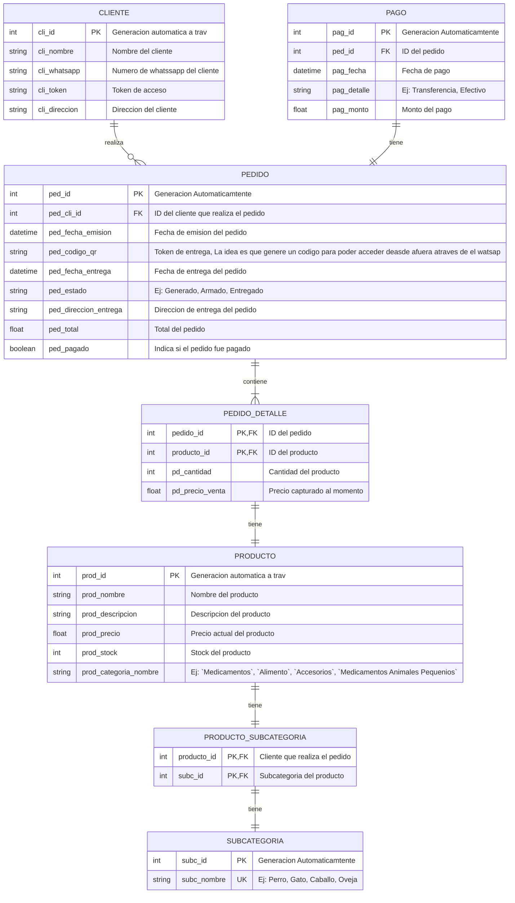

# VetCore

🐾 **VetCore Ecosystem by NorthCode**

VetCore es una plataforma integral de gestión veterinaria diseñada para cerrar la brecha entre la atención clínica de pequeñas mascotas y la gestión productiva de grandes animales. Desarrollado con un enfoque en **Rigor Científico**, **Escalabilidad** y **Cumplimiento Normativo (SNIG/DILAVE)**.

Este repositorio contiene el núcleo del sistema, diseñado como una solución *White Label* para clínicas veterinarias que buscan profesionalizar su identidad digital y optimizar su flujo de caja mediante e-commerce y logística integrada.

## 🚀 Características Principales

### Fase 1: Identidad & Presencia Digital
- **Landing Page High-Performance**: Desarrollada en React + Tailwind CSS para una carga instantánea.
- **Catálogo Dinámico**: Visualización de productos vía JSON para despliegue rápido.
- **Módulo de Emergencias**: Integración directa con WhatsApp API para asistencia inmediata.

### Fase 2: E-commerce & Logística de Proximidad
- **Smart Cart**: Sistema de pedidos automatizado con cierre en WhatsApp.
- **Gestión de Stock Proactiva**: Control de inventario con soporte para lectores de códigos de barras Bluetooth.
- **Fleet Management**: Aplicación móvil (Flutter) para la organización de repartos por zona y horario.

### Fase 3: Gestión Clínica & Compliance MGAP
- **Historia Clínica Digital**: Registro cronológico detallado y trazabilidad sanitaria.
- **Módulo de Producción**: Gestión por pred io (DICOSE) y seguimiento de patologías en rodeos.
- **Compliance DILAVE/SNIG**: Registro automatizado de específicos y generación de reportes ministeriales.

## 🛠 Stack Tecnológico

- **Frontend**: React.js + Tailwind CSS
- **Backend**: FastAPI (Python)
- **Mobile**: Flutter (Dart), Portales administrativos, clinica, logisticas 
- **Infraestructura**: Docker, Nginx Proxy Manager, PostgreSQL.
- **Comunicación**: WhatsApp Business API.


## 📦 Estructura genera de proyecto

```text
/vet-core
├── apps/                   # Frontend 
│    web-client/            # React (E-commerce y Portal Clientes)
├── api-backend/            # Backend FastAPI 
├── docker-compose.yml       # Orquestador local <!> Falta desarollar 
└── README.md                # Documentación técnica centralizada
``` 


## Modelo Entidad relacion 


El modelo de datos está estructurado para manejar el historial de precios en el carrito y la gestión de productos.

<!> Esto tengo que repararlo segun el nuevo modelo 




## 📊 [Documentacion Frontend Web Clientes](./apps/web-client/README.md)

## 📊 [Documentacion Backend](./api-backend/README.md)


## 📈 Filosofía de Desarrollo

En **NorthCode**, creemos en la **Transparencia Total**. Este proyecto se desarrolla bajo una arquitectura de código abierto y documentado, permitiendo la auditoría técnica y garantizando que el cliente sea dueño de su activo tecnológico.


## 📝 Licencia

Este proyecto es propiedad de **NorthCode**. Se otorga una licencia de uso perpetua a los clientes finales, manteniendo el código abierto para fines de portafolio y mejora comunitaria.

---

Desarrollado con ❤️ en Artigas/Salto, Uruguay por **NorthCode**.

---

> **💡 Tip de Senior PM para el Repo:**
>
> En la descripción corta del repo (la que sale a la derecha en GitHub): Pon algo breve como: *"Comprehensive digital management ecosystem for veterinary clinics and livestock production. Built with React, FastAPI, and Flutter."*
>
> **Topics (Etiquetas):** Agregá etiquetas como `veterinary-software`, `react`, `fastapi`, `flutter`, `snig-uruguay`, `northcode`. Esto ayuda a que el repo se posicione mejor.


