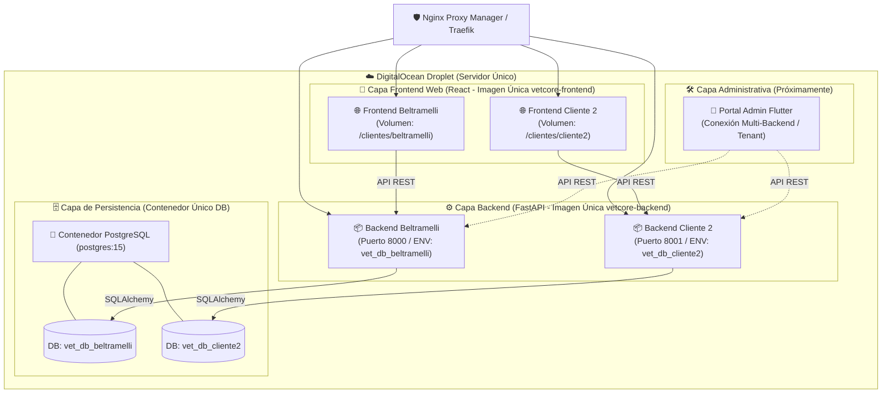

<!-- README.MD -->
# VetCore & NorthCode SaaS Engine

🐾 **Ecosistema Agnóstico Multi-Rubro by [NorthCode](https://northcode-uy.com/)**

> **<!> NOTA DE EVOLUCIÓN ARQUITECTÓNICA:**  
> Aunque la plataforma nació originalmente para la gestión clínica y e-commerce veterinario (**Veterinaria Beltramelli**), el sistema evolucionó hacia un **Motor Agnóstico Multi-Rubro White-Label**. Permite desplegar sitios web, catálogos interactivos, listas de servicios y carritos de compra con cierre de pedido por WhatsApp para **cualquier tipo de comercio o rubro** (clínicas, petshops, ferreterías, tiendas de retail, etc.).

---

## 🌐 Enlaces y Entornos de Revisión

- 🛒 **Instancia de Revisión / Demo Activa (Veterinaria Beltramelli)**: [https://veterinaria-beltramelli.com/revision](https://veterinaria-beltramelli.com/revision)
- 🏢 **Sitio Oficial de Desarrolladores**: [https://northcode-uy.com/](https://northcode-uy.com/)
- 📊 **[Documentación Frontend Web Clientes](./apps/web-client/README.md)**
- ⚙️ **[Documentación Backend API FastAPI](./api-backend/README.md)**

---

## 🚀 Características Principales

### Fase 1: Identidad & Presencia Digital Multi-Cliente (Agnóstica)
- **Landing Page High-Performance**: Desarrollada en React 19 + Tailwind CSS con tematización dinámica en tiempo de ejecución (Zero-Rebuild).
- **Catálogo Dinámico & Servicios**: Visualización de productos y servicios configurable por JSON para cualquier rubro comercial.
- **Módulo de Contacto Directo & WhatsApp**: Conversión inmediata con atención directa configurada por cliente.

### Fase 2: E-commerce Multi-Carrito & Logística por WhatsApp
- **Smart Cart**: Sistema de pedidos automatizado con formateo de ticket dinámico directo a WhatsApp.
- **Gestión de Stock Proactiva**: Control de inventario con soporte para lectores de códigos de barras Bluetooth.
- **Fleet Management**: Organización de repartos por zona y horario.

### Fase 3: Módulos Especializados (Veterinaria / Producción)
- **Historia Clínica Digital**: Registro cronológico detallado y trazabilidad sanitaria para clínicas.
- **Módulo de Producción**: Gestión por predio (DICOSE) y seguimiento de patologías en rodeos.
- **Compliance DILAVE/SNIG**: Registro automatizado de específicos y generación de reportes ministeriales.

---

## 🛠 Stack Tecnológico

- **Frontend Cliente**: React 19 + TypeScript + Tailwind CSS (Inyección de branding en runtime vía JSON).
- **Backend API**: FastAPI (Python 3.12) + SQLAlchemy 2.0 + Pydantic v2.
- **Portal Administrativo**: Flutter (Dart) — *<!> En desarrollo futuro para administración centralizada multi-tienda*.
- **Infraestructura**: Docker, Docker Compose, Nginx Proxy Manager, PostgreSQL.
- **Comunicación**: WhatsApp Business API.

---

## 📦 Estructura General del Proyecto

```text
/vet-core
├── apps/
│   └── web-client/            # Frontend React (E-commerce y Portal Clientes)
├── api-backend/               # Backend FastAPI (REST API, SQLAlchemy, Pydantic)
├── clients/                   # Plantillas y datos de configuración por cliente (Zero-Rebuild)
│   ├── _template/             # Estructura base para nuevos clientes (config.json + assets)
│   └── valeria/               # Assets y marcas de cliente específico
├── docker-compose.yml         # Orquestador multi-servicio local y producción <!> (Pendiente de personalizar por entorno)
└── README.md                  # Documentación técnica centralizada
```

---

## 🏗️ Arquitectura de Despliegue Multi-Tenant (Estrategia por Droplet)

El ecosistema está estructurado bajo un modelo de **Aislamiento por Contenedor por Cliente**, optimizado para ejecutarse eficientemente en un único servidor o VPS (DigitalOcean Droplet):



### Principios Fundamentales:
1. **Un Solo Contenedor de Base de Datos por Droplet**: Un único motor PostgreSQL en ejecución para minimizar uso de recursos. Cada tienda posee su base de datos independiente (`vet_db_beltramelli`, `vet_db_cliente2`, etc.).
2. **Un Contenedor Backend por Carrito/Cliente**: Se reutiliza la **misma imagen de Docker** (`vetcore-backend:latest`), configurada vía variables de entorno (`DB_NAME`, `SECRET_KEY`, `ALLOWED_ORIGINS`, `APP_PORT`).
3. **Un Contenedor Frontend Web por Carrito/Cliente**: Se reutiliza la **misma imagen de Docker** (`vetcore-frontend:latest`), inyectando el `config.json` y los assets por volumen de Docker.
4. **Portal Administrativo Unificado en Flutter**: Desarrollado independientemente en Flutter para la gestión central de catálogo, stock y pedidos.

---

## 🧠 Guía Paso a Paso para Agnostizar el Backend (Comentarios <!> para Desarrollador)

Para terminar de agnostizar el backend sin modificar el código Python existente, sigue esta lista de tareas:

<!-- <!> PUNTOS DE VERIFICACIÓN Y AGNOSTIZACIÓN BACKEND -->

- [ ] **<!> Paso 1: Configurar Variables de Entorno por Instancia (`.env`)**  
  Asegurar que cada contenedor tenga su `DB_NAME` propia (ej: `vet_db_beltramelli`), clave `SECRET_KEY` única y `ALLOWED_ORIGINS` configurado con los dominios permitidos.

- [ ] **<!> Paso 2: Aislar Carpetas de Imágenes Estáticas**  
  Mapear en `docker-compose.yml` el volumen `./storage/<cliente>/productos:/app/app/static/productos` para que los archivos multimedia subidos no se mezclen entre tiendas.

- [ ] **<!> Paso 3: Ingesta de Catálogo Inicial por Comercio**  
  Cargar la plantilla Excel específica del cliente mediante el comando:
  ```bash
  docker exec -it backend-vet-beltramelli python -m app.services.import_excel
  ```

- [ ] **<!> Paso 4: Ajustar Nginx Proxy Manager / SSL**  
  Redirigir las solicitudes públicas HTTPS desde el dominio del cliente (ej: `veterinaria-beltramelli.com`) hacia el puerto del contenedor frontend correspondiente.

- [ ] **<!> Paso 5: Desarrollar e Integrar el Portal Admin en Flutter**  
  Construir la app en Flutter para autenticarse contra `/api/auth/login` y gestionar productos y pedidos consumiendo la URL base de cada cliente.

---

## 💻 Ejemplo de `docker-compose.yml` Multi-Instancia

```yaml
version: '3.8'

services:
  # 🗄️ 1. Motor Único de Base de Datos para el Droplet
  db-postgres-main:
    image: postgres:15
    container_name: postgres_main_db
    restart: always
    environment:
      POSTGRES_USER: postgres
      POSTGRES_PASSWORD: password_seguro_db
    volumes:
      - postgres_data_droplet:/var/lib/postgresql/data
    networks:
      - northcode-net

  # ⚙️ 2. Backend Instancia 1 (Beltramelli)
  backend-beltramelli:
    image: vetcore-backend:latest
    container_name: backend_beltramelli
    restart: always
    environment:
      - IS_DOCKER=true
      - DB_HOST=db-postgres-main
      - DB_USER=postgres
      - DB_PASSWORD=password_seguro_db
      - DB_NAME=vet_db_beltramelli
      - APP_PORT=8000
      - ALLOWED_ORIGINS=https://veterinaria-beltramelli.com
    volumes:
      - ./storage/beltramelli/productos:/app/app/static/productos
    depends_on:
      - db-postgres-main
    networks:
      - northcode-net

  # 🌐 3. Frontend Cliente Web Instancia 1 (Beltramelli)
  web-beltramelli:
    image: vetcore-frontend:latest
    container_name: web_beltramelli
    restart: always
    volumes:
      - ./clientes/beltramelli/config.json:/usr/share/nginx/html/config/client_info.json:ro
      - ./clientes/beltramelli/assets:/usr/share/nginx/html/tenant:ro
    ports:
      - "3001:80"
    networks:
      - northcode-net

networks:
  northcode-net:
    external: true

volumes:
  postgres_data_droplet:
```

---

## 📈 Filosofía de Desarrollo

En **NorthCode**, creemos en la **Transparencia Total** y la **Arquitectura Agnóstica**. Este proyecto está diseñado para permitir la reutilización de código en múltiples modelos de negocio, garantizando la soberanía tecnológica del cliente.

---

## 📝 Licencia

Este proyecto es propiedad de **NorthCode**. Se otorga una licencia de uso perpetua a los clientes finales, manteniendo el código abierto para fines de portafolio y mejora comunitaria.

---

Desarrollado con ❤️ por **[NorthCode](https://northcode-uy.com/)** — Artigas / Salto, Uruguay.

