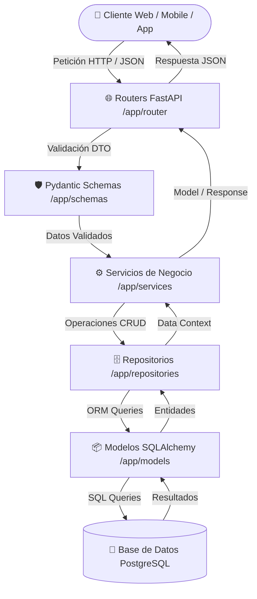
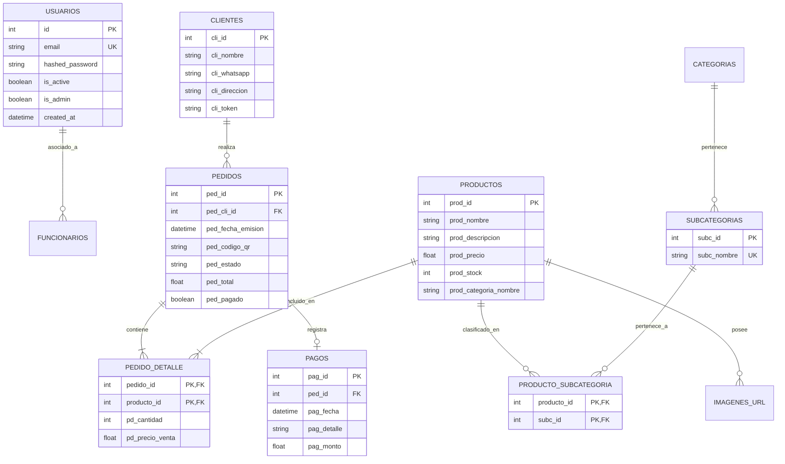
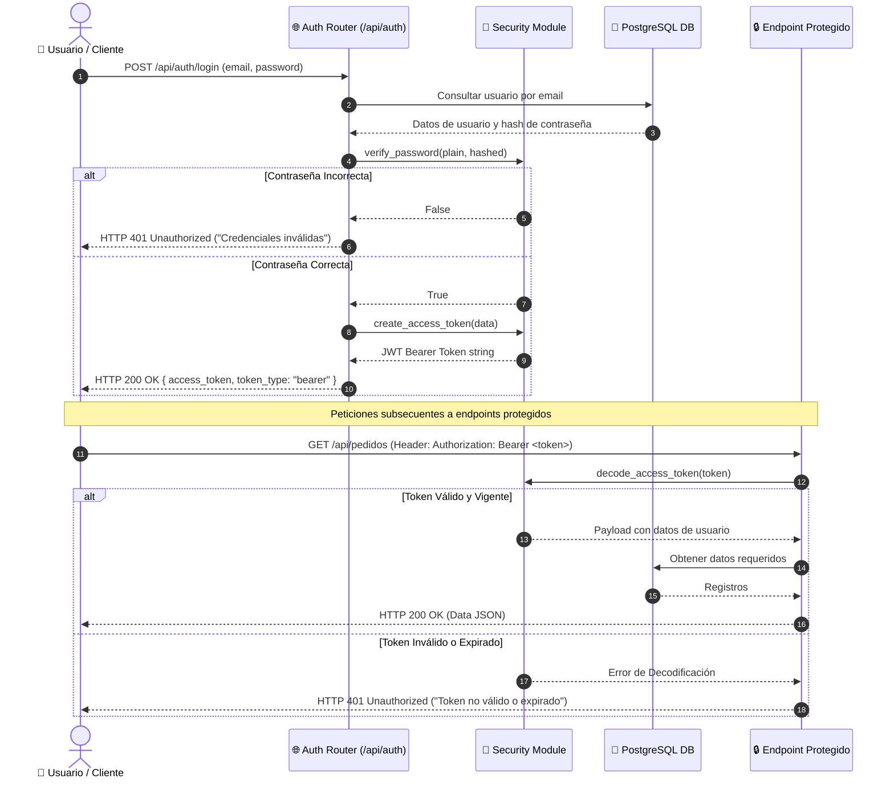

# ⚙️ VetCore API Backend (FastAPI)

<!-- api-backend/README.md -->

> **Núcleo de Servicios REST, Gestión de Inventario, Autenticación y Persistencia de VetCore**

El módulo **API Backend** de VetCore proporciona una arquitectura sólida, escalable y desacoplada basada en **FastAPI**, **SQLAlchemy ORM** y **PostgreSQL**. Está diseñado siguiendo un patrón de arquitectura en capas (Routers -> Schemas -> Services -> Repositories -> Models) que garantiza mantenibilidad, validación estricta de datos y separación clara de responsabilidades.

---

## 🛠 Tecnologías Utilizadas

A continuación se detallan las principales tecnologías y librerías que conforman la pila técnica del backend, junto a sus enlaces directos a la documentación oficial:

- 🚀 **[FastAPI](https://fastapi.tiangolo.com/)**: Framework web moderno de alto rendimiento para construir APIs REST en Python basadas en tipos estandarizados.
- 🗄️ **[SQLAlchemy 2.0](https://docs.sqlalchemy.org/en/20/)**: ORM (Object-Relational Mapping) y toolkit SQL para la interacción type-safe con la base de datos PostgreSQL.
- 🛡️ **[Pydantic v2](https://docs.pydantic.dev/latest/)**: Librería para la validación estricta de datos de entrada/salida y gestión de configuraciones mediante `pydantic-settings`.
- ⚡ **[Uvicorn](https://www.uvicorn.org/)**: Servidor web ASGI de ultra-alta velocidad utilizado para ejecutar la aplicación FastAPI en entornos de desarrollo y producción.
- 🐘 **[PostgreSQL](https://www.postgresql.org/docs/)**: Sistema de gestión de bases de datos relacional de clase empresarial para persistencia de transacciones e inventario.
- 🔑 **[Python-JOSE](https://python-jose.readthedocs.io/) / [PyJWT](https://pyjwt.readthedocs.io/)**: Implementación de JSON Web Tokens (JWT) para autenticación stateless y seguridad de endpoints.
- 🔐 **[Passlib (Bcrypt)](https://passlib.readthedocs.io/)**: Algoritmo de hashing de contraseñas de alta seguridad para la protección de credenciales de usuario.
- 📊 **[Pandas](https://pandas.pydata.org/docs/) & [OpenPyXL](https://openpyxl.readthedocs.io/)**: Herramientas de procesamiento y manipulación de datos para la importación masiva de productos desde planillas de Excel.
- 🐳 **[Docker](https://docs.docker.com/) & [Docker Compose](https://docs.docker.com/compose/)**: Plataforma de contenedorización y orquestación para despliegues consistentes y aislados.

---

## 📦 Estructura del Proyecto

A continuación se presenta la estructura de directorios del backend. El diseño modular mantiene separados los modelos relacionales, la validación de contratos API, la lógica de negocio y el acceso a datos.

```text
api-backend/
├── Dockerfile                 # Configuración de la imagen Docker del backend
├── docker-compose.yml         # Orquestación de contenedores (FastAPI + PostgreSQL)
├── requirements.txt           # Lista de dependencias del proyecto Python
├── run_desarollo.py           # Script para ejecutar la API en desarrollo con Uvicorn
├── .env.example               # Plantilla con variables de entorno requeridas
├── .env                       # Configuración de variables de entorno locales (git-ignored)
└── app/
    ├── __init__.py
    ├── main.py                # Punto de entrada principal (FastAPI, CORS, Routers, Static Files)
    ├── config.py              # Carga y validación de variables de entorno con Pydantic Settings
    ├── database.py            # Configuración de SQLAlchemy, Engine, SessionLocal y Base Declarativa
    ├── security.py            # Funciones de hashing de contraseñas (Bcrypt) y creación/verificación de JWT
    ├── models/                # Modelos ORM de Base de Datos (SQLAlchemy)
    │   ├── __init__.py        # Exposición centralizada de los modelos
    │   ├── user_model.py      # Usuarios administradores y credenciales del sistema
    │   ├── cliente_model.py   # Registro y datos de clientes
    │   ├── funcionario_model.py # Personal veterinario y funcionarios
    │   ├── categoria_model.py # Categorías principales de productos
    │   ├── subcategoria_model.py # Subcategorías del catálogo
    │   ├── producto_model.py  # Productos, stock, precios e inventario
    │   ├── producto_subcategoria_model.py # Tabla relacional M:N entre Productos y Subcategorías
    │   ├── imagen_url_model.py # URLs de imágenes asociadas a productos
    │   ├── pedido_model.py    # Cabecera de pedidos y estados de venta
    │   ├── pedido_detalle_model.py # Detalle e items individuales por pedido
    │   └── pago_model.py      # Transacciones y registro de pagos
    ├── repositories/          # Capa de Acceso a Datos (Repository Pattern)
    │   ├── __init__.py
    │   └── product_repo.py    # Consultas y operaciones CRUD de productos en base de datos
    ├── router/                # Endpoints de la API REST (Controladores HTTP)
    │   ├── __init__.py
    │   ├── auth_router.py     # Endpoints de autenticación, login y tokens (/api/auth)
    │   ├── pedido_route.py    # Endpoints de gestión y flujo de pedidos (/api/pedidos)
    │   └── producto_router.py # Endpoints de catálogo e inventario (/api/productos)
    ├── schemas/               # Validación de Datos y DTOs (Pydantic Schemas)
    │   ├── __init__.py
    │   ├── producto_schema.py # Schemas para creación, edición y respuesta de productos
    │   └── user_schema.py     # Schemas para usuarios, login, registro y tokens JWT
    ├── services/              # Lógica de Negocio e Integraciones Externas
    │   ├── import_excel.py    # Servicio de importación e ingesta de productos desde Excel (.xlsx)
    │   ├── product_service.py # Servicio de negocio para catálogo, precios y gestión de stock
    │   ├── qr_generator.py    # Generación de códigos QR para verificación de pedidos
    │   ├── token_service.py   # Servicio auxiliar para validez de tokens
    │   └── whatsapp_service.py# Integración para notificaciones automáticas por WhatsApp
    └── static/                # Archivos estáticos servidos públicamente
        ├── productos/         # Almacenamiento local de imágenes de productos subidas
        └── productos.csv      # Archivo base de productos para importación
```

---

## 📊 Arquitectura y Diagramas de Flujo

### 1. Arquitectura en Capas (Layered Pattern)

El sistema procesa cada petición a través de un flujo unidireccional desacoplado:



---

### 2. Modelo de Entidad-Relación (ERD)

A continuación se detalla la estructura relacional de la base de datos implementada a través de SQLAlchemy:



---

### 3. Flujo de Autenticación y Seguridad (JWT)



---

## 🚀 Guía de Instalación y Configuración

### Requisitos Previos
- **Python 3.10+** (Recomendado 3.12)
- **Docker** y **Docker Compose V2**
- **Git**

---

### Opción 1: Desarrollo Local (Virtualenv)

1. **Clonar el repositorio y entrar a la carpeta del backend**:
   ```bash
   cd api-backend
   ```

2. **Crear y activar un entorno virtual**:
   - En Linux/macOS:
     ```bash
     python3 -m venv venv
     source venv/bin/activate
     ```
   - En Windows (PowerShell):
     ```powershell
     python -m venv venv
     .\venv\Scripts\Activate.ps1
     ```

3. **Instalar dependencias**:
   ```bash
   pip install --upgrade pip
   pip install -r requirements.txt
   ```

4. **Configurar el archivo de entorno (`.env`)**:
   Copia el archivo de plantilla `.env.example` y renómbralo a `.env`:
   ```bash
   cp .env.example .env
   ```
   Asegúrate de ajustar los valores correspondientes:
   ```env
   DB_USER=postgres
   DB_PASSWORD=tu_password
   DB_HOST=localhost
   DB_PORT=5432
   DB_NAME=vet_core_db
   SECRET_KEY=tu_clave_secreta_jwt
   ```

5. **Iniciar la aplicación en modo desarrollo**:
   ```bash
   python run_desarollo.py
   ```
   O alternativamente usando Uvicorn directamente:
   ```bash
   uvicorn app.main:app --reload --port 8000
   ```

---

### Opción 2: Despliegue con Docker y Docker Compose

1. **Crear la red externa necesaria para los contenedores**:
   > [!IMPORTANT]
   > El archivo `docker-compose.yml` requiere la red externa `northcode-net`. Si no existe, créala antes de iniciar:
   ```bash
   docker network create northcode-net
   ```

2. **Construir y levantar los servicios**:
   ```bash
   docker-compose up -d --build
   ```
   Esto levantará automáticamente:
   - Contenedor de **PostgreSQL** (`vet_db_bel`) en la red `northcode-net`.
   - Contenedor del **API Backend** (`vet_core_backend`) expuesto en el puerto `8000`.

3. **Verificar el estado de los contenedores**:
   ```bash
   docker-compose ps
   ```

4. **Ver los logs en tiempo real**:
   ```bash
   docker-compose logs -f backend-vet-bel
   ```

---

### Importación de Datos y Estándar de Entorno

Luego de haber instalado todo lo necesario y haber puesto en marcha el servidor, queda agregar los productos a la base de datos.
Estos vienen en un archivo en formato Excel, el cual hay que ejecutar y automaticamente se agregan a su base de datos

1. **Si no has activado venv**:
   > [!IMPORTANT]
   > Es necesario activarlo para poder poner en funcionamiento este proyecto, teniendo en cuenta que estas en la raiz del mismo, ejecuta lo siguiente en la terminal en Windows:
   ```powershell
   cd api-backend
   .\venv\Scripts\Activate.ps1
   ```
   > [!IMPORTANT]
   > De lo contrario si estas en Linux o Mac ejecuta lo siguiente:
   ```bash
   cd api-backend
   source venv/bin/activate
   ```

2. **Agregar datos a la base**:
   > [!IMPORTANT]
   > Ejecuta este script en la terminal luego de haber activado (venv) y estar en la carpeta api-backend:
   ```bash
   python -m app.services.import_excel
   ```
Te deberia de aparecer un mensaje como: ¡Carga completada con éxito!

---

## 📖 Documentación Interactiva de la API

Una vez que el servidor esté ejecutándose (localmente o en Docker), puedes explorar y probar los endpoints interactivos desde el navegador:

- **Swagger UI**: [http://localhost:8000/docs](http://localhost:8000/docs)
- **ReDoc**: [http://localhost:8000/redoc](http://localhost:8000/redoc)
- **Verificación de Salud (Health Check)**: [http://localhost:8000/](http://localhost:8000/)

---

## ❓ Solución de Problemas Comunes

> [!WARNING]
> **Error `network northcode-net declared as external, but could not be found`**:
> Ocurre cuando se intenta ejecutar `docker-compose up` sin haber creado la red externa de Docker previa.
> **Solución**: Ejecuta `docker network create northcode-net`.

> [!WARNING]
> **Error de conexión a PostgreSQL (`psycopg2.OperationalError`)**:
> Verifica que el servicio de PostgreSQL esté iniciado y que las credenciales en el archivo `.env` (`DB_USER`, `DB_PASSWORD`, `DB_NAME`, `DB_HOST`) coincidan con tu base de datos. Si usas Docker, la variable `IS_DOCKER=true` configura automáticamente el host a la base de datos dentro del contenedor.

> [!NOTE]
> **CORS / Peticiones bloqueadas desde el Frontend (React)**:
> Revisa la configuración `origins_list` en `app/config.py` y asegúrate de incluir la URL y puerto de tu frontend React (ej: `http://localhost:5173`).

---

 Desarrollado por **NorthCode** para el ecosistema **VetCore**.