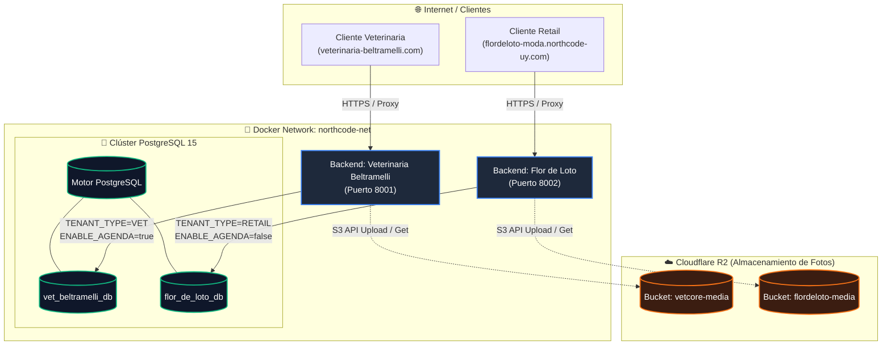

<!-- api-backend/docs/architecture/diagramabakend.md -->

# 🏛️ Arquitectura del backend

```mermaid
graph TD
    %% SUBGRAPH: INTERNET / CLIENTES
    subgraph clients ["🌐 Internet / Clientes"]
        C1["Cliente Veterinaria<br/>(veterinaria-beltramelli.com)"]
        C2["Cliente Retail<br/>(flordeloto-moda.northcode-uy.com)"]
    end

    %% SUBGRAPH: DOCKER NETWORK
    subgraph docker_net ["🐳 Docker Network: northcode-net"]
        %% Backends por Tenant
        BV["Backend: Veterinaria Beltramelli<br/>(Puerto 8001)"]
        BF["Backend: Flor de Loto<br/>(Puerto 8002)"]

        %% Base de Datos
        subgraph pg_cluster ["🐘 Clúster PostgreSQL 15"]
            PG[("Motor PostgreSQL")]
            DB1[("vet_beltramelli_db")]
            DB2[("flor_de_loto_db")]
            PG --- DB1
            PG --- DB2
        end
    end

    %% SUBGRAPH: CLOUDFLARE R2
    subgraph r2_storage ["☁️ Cloudflare R2 (Almacenamiento de Fotos)"]
        R2_1[("Bucket: vetcore-media")]
        R2_2[("Bucket: flordeloto-media")]
    end

    %% RELACIONES / FLUJOS
    C1 -->|HTTPS / Proxy| BV
    C2 -->|HTTPS / Proxy| BF

    BV -->|TENANT_TYPE=VET<br/>ENABLE_AGENDA=true| DB1
    BF -->|TENANT_TYPE=RETAIL<br/>ENABLE_AGENDA=false| DB2

    BV -.->|S3 API Upload / Get| R2_1
    BF -.->|S3 API Upload / Get| R2_2

    %% ESTILOS VISUALES
    classDef container fill:#1e293b,stroke:#3b82f6,stroke-width:2px,color:#fff;
    classDef database fill:#0f172a,stroke:#10b981,stroke-width:2px,color:#fff;
    classDef cloud fill:#3b1d11,stroke:#f97316,stroke-width:2px,color:#fff;

    class BV,BF container;
    class PG,DB1,DB2 database;
    class R2_1,R2_2 cloud;

```
