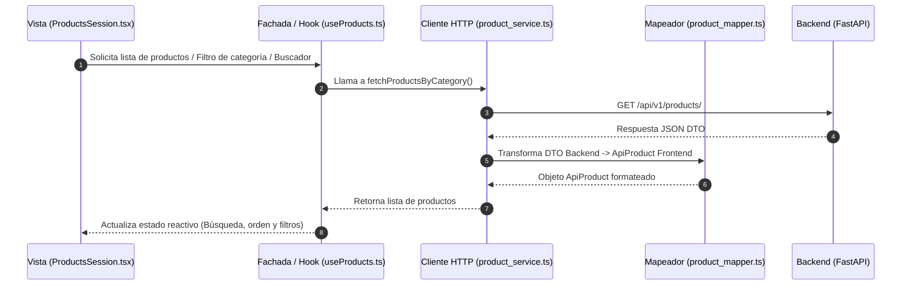
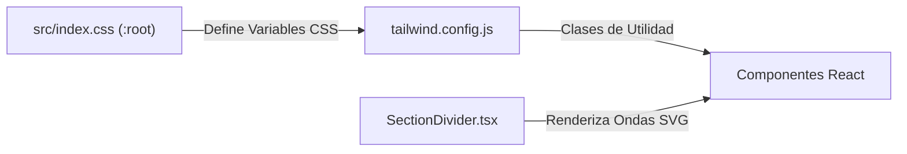

<!-- apps/web-client/README.md -->
# 🐾 Web Client - Veterinaria Beltramelli (Frontend)

Plataforma de Gestión Veterinaria y E-commerce desarrollada para la **Veterinaria Beltramelli** en Salto, Uruguay. Este proyecto utiliza una arquitectura de Monorepo escalable desde una Landing Page institucional y comercial hasta un ecosistema completo de gestión clínica, catálogo de productos y checkout de pedidos.

---

## 🚀 Stack Tecnológico (Documentación Oficial)

- **[React 19](https://react.dev/)**: Biblioteca de UI para construir la interfaz declarativa y reactiva.
- **[Vite 8](https://vitejs.dev/)**: Herramienta de construcción (*build tool*) de alta velocidad para desarrollo local y producción.
- **[TypeScript](https://www.typescriptlang.org/)**: Tipado estático para mayor seguridad, mantenibilidad y autocompletado en el editor.
- **[Tailwind CSS v3.4](https://tailwindcss.com/)**: Framework CSS de utilidades para un diseño responsivo "Pixel Perfect".
- **[React Router DOM v7](https://reactrouter.com/)**: Manejo de rutas SPA (ej. `/` para landing page y `/mantenimiento` para estado de desarrollo).
- **[Lucide React](https://lucide.dev/)**: Colección de iconos vectoriales ligeros y consistentes.
- **[Lottie React](https://airbnb.io/lottie/)**: Renderizador de animaciones JSON para elementos dinámicos interactivos.

---

## 🏛️ Arquitectura del Frontend y Flujo de Datos

El frontend sigue el patrón **Fachada (Facade)** en la capa de datos/hooks y una separación limpia entre la UI visual, el estado reactivo y los servicios de red HTTP.

* 📄 **Diagrama de Arquitectura**: [Arquitectura del Frontend](docs/architecture/diagrama_arquitectura_fontend.md)
* 📄 **Diagrama de Secuencia**: [Diagrama de Secuencia Frontend](docs/architecture/diagrama_secuencia_fronten.md)

### 🔄 Flujo de Datos y Conexión Frontend-Backend

El flujo de información desde la interfaz hasta la API Backend (FastAPI) sigue la siguiente trayectoria por capas:



1. 🟢 **Componente Vista** ([`ProductsSession.tsx`](src/pages/landing/sessions/ProductsSession.tsx)):
   Renderiza la interfaz visual del catálogo, el cuadro de búsqueda y los botones de categoría. No realiza peticiones HTTP directamente; invoca al hook `useProducts`.
2. 🟢 **Fachada / Hook** ([`useProducts.ts`](src/hooks/useProducts.ts)):
   Custom Hook de React que actúa como fachada de la lógica de negocio. Encapsula la búsqueda en tiempo real, el filtrado por categorías, el ordenamiento (precio/nombre) y la gestión del estado de carga/error.
3. 🟢 **Cliente HTTP / Endpoints** ([`product_service.ts`](src/services/product_service.ts)):
   Capa de infraestructura de red pura. Construye las rutas de las peticiones HTTP (`GET`, `POST`, `PUT`) hacia la API REST en FastAPI y delega la transformación de datos al mapeador.
4. 🟢 **Mapeador de Modelos** ([`product_mapper.ts`](src/mapper/product_mapper.ts)):
   Transforma las estructuras de datos DTO provenientes del Backend a los tipos TypeScript estrictos del Frontend ([`product_types.ts`](src/types/product_types.ts)).
5. 🟢 **Contexto de Pedidos** ([`pedido_context.tsx`](src/context/pedido_context.tsx)):
   Gestor de Estado Global del Carrito. Permite agregar/quitar ítems desde cualquier componente (`ProductCard`) y sincronizarlos con el checkout ([`PedidoDrawer.tsx`](src/pages/pedido/PedidoDrawer.tsx)).

---

## 🎨 Sistema de Colores, Estilos y Componentes Visuales

El diseño combina variables CSS globales centralizadas con utilidades de Tailwind CSS y divisores vectoriales SVG para intercalar fondos entre secciones:



### 🔗 Acceso Directo a Archivos de Estilos y Diseño
* 🎨 **Variables CSS Globales**: [`index.css`](src/index.css)
* 🎨 **Configuración de Tailwind**: [`tailwind.config.js`](tailwind.config.js)
* 🎨 **Configuración de UI**: [`ui-config.ts`](src/config/ui-config.ts)
* 🎨 **Divisor SVG Ondulado Dinámico**: [`SectionDivider.tsx`](src/components/SectionDivider.tsx) (Utilizado en la Landing Page para alternar colores de fondo entre secciones).

---

## 📂 Estructura del Código en `src/`

Para facilitar la navegación en el repositorio, a continuación se presenta la estructura de archivos linkeable del proyecto web:

```text
apps/web-client/src/
├── 📄 App.tsx                         # Enrutador principal (React Router DOM) y punto de entrada visual
├── 📄 App.css                         # Estilos base de la aplicación
├── 📄 index.css                       # Variables CSS globales (:root) y directivas de Tailwind
├── 📄 main.tsx                        # Punto de arranque de React 19 / Vite
├── 📄 vite-env.d.ts                   # Tipado de variables de entorno de Vite
│
├── 📁 assets/                         # Recursos estáticos corporativos y animaciones
│   ├── 📁 animations/                 # Animaciones JSON Lottie (ej. maintenance.json)
│   ├── 📁 branding/                   # Logotipos y SVGs (caballo.svg, guella.svg, SeccionPrincipalFondo.svg)
│   └── 📄 producto_no_disponible.png  # Imagen placeholder para productos sin foto
│
├── 📁 components/                     # Componentes UI atómicos y reutilizables
│   ├── 📁 ProductCard/                # Variaciones de tarjetas de productos
│   │   ├── 📄 ProductCardV1.tsx
│   │   └── 📄 ProductCardV2.tsx
│   ├── 📄 CategoryGroupCard.tsx       # Agrupador visual por categorías de productos
│   ├── 📄 ConfirmationModal.tsx        # Modal modal para confirmar acciones (ej. vaciar carrito)
│   ├── 📄 PlanCard.tsx                # Tarjeta de presentación de planes sanitarios y promociones
│   ├── 📄 ProductCard.tsx             # Tarjeta individual de producto integrada con el carrito
│   ├── 📄 SectionDivider.tsx          # Divisor vectorial SVG animado con colores dinámicos
│   ├── 📄 ServiceCard.tsx             # Tarjeta de servicios veterinarios
│   ├── 📄 WhatsAppButtonProps.tsx     # Tipos y propiedades para botones de contacto
│   └── 📄 WhatsAppDynamicButton.tsx   # Botón interactivo de comunicación directas por WhatsApp
│
├── 📁 config/                         # Configuraciones del cliente web
│   └── 📄 ui-config.ts                # Parámetros y constantes visuales globales
│
├── 📁 context/                        # Estado Global de React (Context API)
│   ├── 📄 auth_context.tsx            # Contexto de autenticación de usuarios
│   └── 📄 pedido_context.tsx          # Contexto del carrito de compras y gestión de pedidos
│
├── 📁 data/                           # Datos estáticos en JSON (Fallback / Mock data)
│   ├── 📄 companyInfo.json            # Información institucional, teléfonos y horarios
│   ├── 📄 productos.json              # Catálogo mock de productos
│   ├── 📄 promociones.json            # Planes y programas sanitarios
│   └── 📄 servicios.json              # Lista de servicios veterinarios ofrecidos
│
├── 📁 hooks/                          # Custom Hooks / Fachadas de Negocio
│   ├── 📄 useAddressManagement.ts     # Gestión de direcciones de entrega del cliente
│   └── 📄 useProducts.ts              # Fachada de productos (búsqueda, filtros y ordenamiento)
│
├── 📁 mapper/                         # Transformación de datos DTO -> Modelos Frontend
│   └── 📄 product_mapper.ts           # Mapeador de respuesta API Backend a ApiProduct
│
├── 📁 pages/                          # Ventanas / Páginas principales conectadas al Router
│   ├── 📁 cliete/                     # [Portal Cliente] Registro y perfil de usuario
│   │   └── 📄 register_cliente.tsx
│   ├── 📁 landing/                    # 🏠 [Módulo Landing Page] página de inicio y sus secciones
│   │   ├── 📄 LlandingPage.tsx        # Orquestador principal de la Landing Page
│   │   └── 📄 README.md               # 📖 Documentación detallada del Módulo Landing Page
│   ├── 📁 maintenance/                # Vista de mantenimiento temporal
│   │   └── 📄 MaintenancePage.tsx
│   └── 📁 pedido/                     # 🛒 [Módulo Pedidos] Carrito lateral y Checkout
│       ├── 📄 PedidoDrawer.tsx        # Drawer lateral del carrito de compras
│       └── 📄 README.md               # 📖 Documentación detallada del Módulo Pedidos
│
├── 📁 services/                       # Cliente HTTP puro e Infraestructura de Red
│   ├── 📄 auth_service.ts             # Peticiones HTTP de autenticación
│   ├── 📄 logger.ts                   # Servicio de logs de sistema
│   └── 📄 product_service.ts          # Peticiones HTTP del catálogo de productos (FastAPI)
│
├── 📁 types/                          # Interfaces y Tipos TypeScript
│   ├── 📄 auth.ts                     # Tipos de sesión y usuario
│   ├── 📄 payment_types.ts            # Métodos de pago y pasarelas
│   ├── 📄 pedido_types.ts             # Estructura del pedido e ítems del carrito
│   └── 📄 product_types.ts            # Entidades y categorías de productos
│
└── 📁 utils/                          # Funciones auxiliares y helpers
    └── 📄 categoryHelpers.tsx         # Normalización e iconografía de categorías
```

---

## 📖 Documentación Modular por Paquetes

Para evitar documentos extensos y mantener una lectura prolija y focalizada, la documentación detallada de cada vista principal se encuentra dividida en sus propios archivos `README.md`:

- 🏠 **[Módulo Landing Page (`pages/landing/README.md`)](src/pages/landing/README.md)**:
  Explicación paso a paso de [`LlandingPage.tsx`](src/pages/landing/LlandingPage.tsx) y sus sub-secciones en `sessions/` ([`HeaderSession`](src/pages/landing/sessions/HederSession.tsx), [`HeroSession`](src/pages/landing/sessions/HeroSession.tsx), [`ProductsSession`](src/pages/landing/sessions/ProductsSession.tsx), [`ServicioSession`](src/pages/landing/sessions/ServicioSession.tsx), `ProgramsSection`, `AboutSection`, [`MapsSession`](src/pages/landing/sessions/MapsSession.tsx) y [`FooterSession`](src/pages/landing/sessions/FooterSession.tsx)).

- 🛒 **[Módulo de Pedidos y Carrito (`pages/pedido/README.md`)](src/pages/pedido/README.md)**:
  Documentación completa del panel lateral Off-Canvas ([`PedidoDrawer.tsx`](src/pages/pedido/PedidoDrawer.tsx)), los controles numéricos editable en [`PedidoItemRow.tsx`](src/pages/pedido/PedidoItemRow.tsx), el acordeón checkout [`PedidoFooterCollapsible.tsx`](src/pages/pedido/PedidoFooterCollapsible.tsx) y la generación del mensaje estructurado para WhatsApp.

---

## 🛠️ Configuración de Entorno y Desarrollo Local

### 💻 Guía por Sistema Operativo

#### 🪟 En Windows (Recomendado usar WSL2)
Si trabajas en Windows, **se recomienda encarecidamente utilizar WSL2 (Windows Subsystem for Linux)** para obtener el mejor rendimiento de desarrollo y compatibilidad con Docker:
* 📄 **Guía de Instalación Oficial de WSL**: [Documentación Microsoft WSL](https://learn.microsoft.com/es-es/windows/wsl/install)
* **Pasos recomendados**:
  1. Clona e instala el proyecto dentro del sistema de archivos Linux (ej. `~/Documentos/proyect/app/vet-core`) en lugar de la partición `/mnt/c/`.
  2. Abre tu terminal WSL2 e instala Node.js (v18+).

#### 🐧 En Linux / macOS
Asegúrate de contar con Node.js y npm instalados en tu sistema:
* 📄 **Instalación Oficial de Node.js / npm**: [Sitio Oficial Node.js](https://nodejs.org/)

```bash
# 1. Entrar a la carpeta del cliente web
cd apps/web-client

# 2. Instalar dependencias del proyecto
npm install

# 3. Iniciar el servidor de desarrollo en modo local (Vite)
npm run dev
```


<!-- <!> Levantar las direrentes versiones de carrito 

Levantar un proyecto de un cliete espesifico

npm run dev:valeria

Cambiar a otro cliente en nivel ejecucion 
npm run tenant flavia_esponda


---

### 4. Documentación: `docs/MULTI_TENANT_ARCHITECTURE.md`

```markdown
# 🏢 Arquitectura Multi-tenant SaaS: VetCore Frontend

Este documento explica cómo funciona el sistema de tematización, inyección de configuración en tiempo de ejecución y aislamiento por cliente sin recompilar la aplicación.

---

## 🔄 Flujo de Datos en Tiempo de Ejecución (Zero-Rebuild)

```text
1. [Disco Host / Docker Volume]
   clients/valeria/config.json + assets/
           │
           ▼
2. [Servidor Web / Directorio Público]
   /public/config/client_info.json + /public/tenant/
           │
           ▼ (fetch al iniciar)
3. [TenantProvider (React Context)]
   - Lee client_info.json
   - Limpia comentarios (// y /* */) en memoria
   - Parsea JSON a objeto tipado (TenantConfig)
           │
           ▼
4. [theme_config.ts]
   - Convierte Hexadecimales (#275D9E) a canales RGB ("39 93 158")
   - Inyecta variables CSS en document.documentElement (:root)
           │
           ▼
5. [Tailwind CSS + Componentes]
   - Las clases semánticas (bg-vete-primary, text-vete-dark) leen las variables CSS
   - Las imágenes se cargan desde /tenant/logo.png
```

---

## 📁 Estructura del Directorio `clients/`

```text
vet-core/
├── clients/
│   ├── _template/             # ✅ EN GIT: Plantilla base para clonar
│   │   ├── config.json        # Archivo con todas las propiedades comentadas
│   │   └── assets/            # Imágenes de ejemplo (logo.png, mision.png, etc.)
│   │
│   ├── valeria/               # 🚫 EN .GITIGNORE: Datos del cliente real
│   │   ├── config.json
│   │   └── assets/
│   │
│   └── flavia_esponda/        # 🚫 EN .GITIGNORE: Datos de otro cliente real
│       ├── config.json
│       └── assets/
```

---

## 🚀 Guía de Operación Diaria

### 1. Levantar un Cliente en Desarrollo Local
Para cambiar instantáneamente de cliente en tu máquina local:

```bash
# Para levantar a Valeria:
npm run dev:valeria

# Para levantar la plantilla de pruebas:
npm run dev:template

# Para cambiar a cualquier otro cliente:
npm run tenant <nombre_carpeta_cliente>
```

### 2. Crear un Cliente Nuevo en 3 Pasos
1. Duplica la carpeta `clients/_template/` y nómbrala con el slug del cliente (ej: `clients/ferreteria_central/`).
2. Pega sus imágenes dentro de `clients/ferreteria_central/assets/`.
3. Ajusta los colores, teléfonos y textos en `clients/ferreteria_central/config.json`.
4. Ejecuta:
   ```bash
   npm run tenant ferreteria_central
   ```

---

## 🎨 Paleta de Tokens Semánticos (`vete-*`)

Queda prohibido usar nombres fijos de Tailwind como `bg-emerald-900` o `text-red-500`. Usa exclusivamente:

| Clase Tailwind | Propósito |
| :--- | :--- |
| `bg-vete-primary` / `text-vete-primary` | Color principal de marca (Botones CTA, enlaces activos). |
| `hover:bg-vete-primary-hover` | Estado hover para elementos con color primario. |
| `bg-vete-secondary` / `text-vete-secondary` | Color secundario (Badges, acentos). |
| `bg-vete-tertiary` / `text-vete-tertiary` | Canales de contacto directo (WhatsApp). |
| `bg-vete-dark` | Fondos oscuros estructurales (Header, Footers, modales). |
| `bg-vete-surface` | Fondo para tarjetas y áreas de contenido claro. |
| `bg-vete-soft` / `text-vete-soft` | Tinte suave de marca para chips pasivos. |
| `bg-vete-overlay` | Fondos oscurecidos para backdrops de modales. |
| `text-vete-base` | Color principal para textos de lectura continua. |
| `text-vete-muted` | Color secundario para subtítulos y placeholders. |
| `border-vete-subtle` | Bordes suaves y líneas divisorias. |
| `text-vete-error` / `bg-vete-error` | Acciones destructivas y alertas. |

---

# 🏢 Arquitectura Multi-tenant SaaS: VetCore

Este documento detalla la arquitectura de desacoplamiento para clientes (*Zero-Rebuild SaaS Architecture*), el flujo de sincronización en desarrollo local mediante `switch-tenant.js` y el despliegue multi-contenedor con Docker.

---

## 🧩 1. Concepto Central: Separación de Identidad y Código

React se compila **una sola vez** con componentes agnósticos. Toda la identidad corporativa (logos, paleta de colores, textos institucionales, teléfonos y variantes) se inyecta desde afuera sin tocar el código TypeScript.

```text
[CARPETA DE CLIENTE]                  [SCRIPT O DOCKER]                 [APLICACIÓN REACT]
clients/valeria/config.json    ───►   public/config/client_info.json  ───►  useConfig()
clients/valeria/assets/        ───►   public/tenant/                  ───►  


## 🐳 Despliegue en Producción (Docker)

En producción, la misma imagen de React se utiliza para todos los clientes montando sus carpetas por volumen en `docker-compose.yml`:

```yaml
services:
  web_valeria:
    image: vetcore-frontend:latest
    container_name: web_valeria
    volumes:
      - ./clients/valeria/config.json:/usr/share/nginx/html/config/client_info.json:ro
      - ./clients/valeria/assets:/usr/share/nginx/html/tenant:ro
    ports:
      - "3001:80"
```
```


 -->

> ⚠️ **Nota sobre la API Backend**: Si el servidor Backend en FastAPI no está encendido en ese momento, el cliente web cargará de todas formas utilizando los datos en caché y archivos JSON de fallback ([`productos.json`](src/data/productos.json)).

---

## 🌐 Pruebas en Red Local (LAN) y Compartición Temporal

### 📱 1. Pruebas en Móviles dentro de la Red Local (LAN)
Para probar la aplicación directamente desde tu celular o tablet conectado a la misma red Wi-Fi:

```bash
# Ejecutar desde apps/web-client
# 1. Compilar la imagen Docker
sudo docker build -t vete-celu .

# 2. Detener contenedor previo si está activo
sudo docker stop vete-test

# 3. Exponer en el puerto 3000
sudo docker run -it --rm -p 3000:80 --name vete-test vete-celu
```

### ⚡ 2. Compartición Temporal mediante Túnel de Cloudflare (`esponer_entorno_tem.sh`)
Para mostrar avances a clientes o colaboradores fuera de tu red local sin publicar en producción, el repositorio incluye un script de túneles Cloudflare:
* 📄 **Documentación Oficial**: [Cloudflare Tunnels](https://developers.cloudflare.com/cloudflare-one/connections/connect-networks/)

```bash
# Ejecutar desde la raíz del repositorio /vet-core:
./esponer_entorno_tem.sh
```

El script ([`esponer_entorno_tem.sh`](../../esponer_entorno_tem.sh)) se encarga de:
- Verificar o instalar automáticamente `cloudflared`.
- Levantar un túnel HTTPS seguro para el **Frontend** (Vite) y otro para el **Backend** (FastAPI).
- Generar URLs temporales tipo `https://xxxx.trycloudflare.com` listas para compartir.

---

Desarrollado por **[NorthCode](https://github.com/NorthCodeUY)**. 🚀 E-commerce & Portal Veterinaria Beltramelli. 🐄
