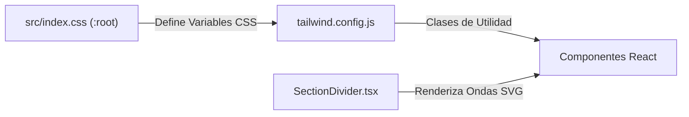

# 🐾 Web Client - Veterinaria Beltramelli (Frontend)

Plataforma de Gestión Veterinaria y E-commerce desarrollada para la **Veterinaria Beltramelli** en Salto, Uruguay. Este proyecto utiliza una arquitectura de Monorepo recomendada para escalar desde una Landing Page inicial hasta un ecosistema completo de gestión clínica, catálogo de productos y pedidos.

---

## 🚀 Stack Tecnológico (Documentación Oficial)

- **[React 19](https://react.dev/)**: Biblioteca de UI para construir la interfaz declarativa.
- **[Vite 8](https://vitejs.dev/)**: Herramienta de construcción (build tool) de alta velocidad para desarrollo local y producción.
- **[TypeScript](https://www.typescriptlang.org/)**: Tipado estático para mayor seguridad y mejor autocompletado en el editor.
- **[Tailwind CSS v3.4](https://tailwindcss.com/)**: Framework CSS de utilidades para un diseño responsivo "Pixel Perfect".
- **[React Router DOM v7](https://reactrouter.com/)**: Manejo de rutas SPA (ej. `/` para mantenimiento y `/revision` para pruebas).
- **[Lucide React](https://lucide.dev/)**: Colección de iconos vectoriales ligeros y consistentes.
- **[Lottie React](https://airbnb.io/lottie/)**: Renderizador de animaciones JSON para elementos dinámicos interactivos.

---

## 🏛️ Arquitectura del Frontend y Flujo de Datos

El frontend sigue el patrón **Fachada (Facade)** en la capa de datos/hooks y una separación limpia entre UI, estado y llamadas HTTP:

- 📄 **Diagrama de Arquitectura**: [Arquitectura del Frontend](docs/architecture/diagrama_arquitectura_fontend.md)

### 🔗 Acceso Directo a Archivos de Arquitectura

Para navegar directamente al código desde el repositorio, haz clic en los siguientes enlaces:

- 📄 **Página Principal**: [`LlandingPage.tsx`](src/pages/landing/LlandingPage.tsx)
  > Punto de entrada principal y orquestador de la web. Es la primera interfaz de impacto para el cliente. Actualmente en proceso de refactorización para extraer componentes y mejorar la modularidad.

- 📄 **Sección de Productos**: [`ProductsSession.tsx`](src/pages/landing/sessions/ProductsSession.tsx)
  > Módulo central del catálogo. Gestiona la visualización de la mercadería y la lógica inicial del carrito, integrando la respuesta de datos proveniente del backend.

- 📄 **Tarjeta de Producto**: [`ProductCard.tsx`](src/components/ProductCard.tsx)
  > Componente atómico de interfaz. Recibe propiedades dinámicas de color para integrarse con el diseño de ondas SVG, permitiendo una separación visual estética entre secciones.

- 📄 **Hook de Productos**: [`useProducts.ts`](src/hooks/useProducts.ts)
  > Fachada de lógica de UI. Este Custom Hook encapsula el estado de los productos, gestionando el mapeo de datos, los filtros por categoría y los criterios de ordenamiento (precio/nombre).

- 📄 **Servicio API Backend**: [`product_service.ts`](src/services/product_service.ts)
  > Capa de infraestructura. Se encarga exclusivamente de las peticiones HTTP al Backend (FastAPI). Su función es aislar la lógica de comunicación para facilitar el mantenimiento y las pruebas.

- 📄 **Contexto de Pedidos**: [`pedido_context.tsx`](src/context/pedido_context.tsx)
  > Gestor de Estado Global. Centraliza la información del carrito y los datos del cliente en toda la aplicación. Permite que cualquier componente acceda a la información del pedido actual sin necesidad de pasar *props* manualmente.

---

- 📄 **Documentación Técnica**: [Diagrama de Secuencia](docs/architecture/diagrama_secuencia_fronten.md)


<!--Aca abria que mejorar aclarar -->
### 🔗 Acceso Directo a los Métodos y Archivos del Flujo
- 🟢 **Componente Vista**: [ProductsSession.tsx](src/pages/landing/sessions/ProductsSession.tsx)
<!--Seccion en la landink pague proudcto esta parte tiene sierta logica porque es donde coencta con la logica para interactuar con el bakend est solo teien parte visual pero desde aca llama useProducts pra traer la informacion de los productos-->

- 🟢 **Fachada / Hook**: [useProducts.ts](src/hooks/useProducts.ts)
<!-- Por lo que entiedo teien logica para el cuadro buacar y la ligica nesesaria para traer los producots de el baked pero no estoy ben segurooo no no esta bien documetada la clase  si el de aajo de encarga de traer el producto  -->

- 🟢 **Cliente HTTP / Endpoints**: [product_service.ts](src/services/product_service.ts)
<!--  aca se encarga de traer los productos de la categoria y hacer por lo que veo es rma la ruta de los get  de el proeuto supongo qu cuando lo requira aramar los put etc para productos  -->

---

## 🎨 Sistema de Colores y Estilos

El sistema combina variables CSS globales centralizadas con utilidades de Tailwind CSS y divisores vectoriales SVG para intercalar fondos entre secciones:



### 🔗 Acceso Directo a Archivos de Estilos
- 🎨 **Variables CSS Globales**: [index.css](src/index.css)
- 🎨 **Configuración de Tailwind**: [tailwind.config.js](tailwind.config.js)

- 🎨 **Divisor SVG Animado**: [SectionDivider.tsx](src/components/SectionDivider.tsx)
<!--Esto no tiene sentido qeu este aca caps si ponelo junto con los componentes en landing page que es el vector para la terminacion de las divisiones de la landing pate -->

---

## 📂 Estructura del Código en `src/`

<!--  Esto estaría genial si fuera algo con macedonio estructura de archivos que fuese linkeable no se si se puede hacer si se puede seria ideal si no sacarlo de aca  y talves ponerlo como un un diagrama aparte -->

```text
apps/web-client/src/
├── assets/          # Recursos estáticos (animaciones JSON, logos, SVGs)
│   ├── animations/  # p.ej. maintenance.json (animación de página en construcción)
│   └── branding/    # Gráficos de marcas y WhatsApp
├── components/      # UI atómica y componentes independientes de la lógica
│   ├── CategoryGroupCard.tsx   # Agrupador visual por categorías
│   ├── PlanCard.tsx            # Tarjeta de presentación de planes
│   ├── ProductCard.tsx         # Tarjeta de producto individual
│   ├── SectionDivider.tsx     # Transición ondulatoria SVG con color dinámico
│   ├── ServiceCard.tsx        # Tarjeta para mostrar servicios ofrecidos
│   ├── WhatsAppButtonProps.tsx # Tipos y props para los botones principales de contacto y llamada a la veterinaria
│   └── WhatsAppDynamicButton.tsx # Botón dinámico interactivo para comunicación directa y emergencias por WhatsApp
├── context/         # Proveedores de estado global (auth_context.tsx, pedido_context.tsx)
├── hooks/           # Custom Hooks / Fachadas de negocio (useProducts.ts)
├── mapper/          # Mapeadores de transformación de DTOs a modelos frontend
├── pages/           # Vistas / Ventanas principales conectadas al Router
│   ├── landing/     # Landing page principal y sus secciones (sessions/)
│   ├── maintenance/ # Vista de mantenimiento temporal para el root `/`
│   ├── pedido/      # [Módulo futuro] Gestión de pedidos
│   └── cliete/      # [Módulo futuro] Portal para clientes
├── services/        # Capa HTTP pura (product_service.ts, auth_service.ts, logger.ts)
├── types/           # Interfaces y tipos TypeScript
└── App.tsx          # Configuración del enrutador React Router DOM (App.tsx)
  
```

### 🔗 Acceso Directo a los Componentes y Vistas Principales:
<!--Esto tendria que ir a como se compone landig page dejarlo todo junto no estar desperdigado  -->

- 🧩 **Sección Hero**: [HeroSession.tsx](src/pages/landing/sessions/HeroSession.tsx)
<!-- Seccion principal de la web es la primera cosa qeu el usario ve al inciar el sistema -->

- 🧩 **Sección Cabecera / Header**: [HederSession.tsx](src/pages/landing/sessions/HederSession.tsx)
<!-- Barra superior de la web siemrpe presente contiene el logito de carrito y la barra de navegacion junto a el log y el nombre de la empresa Y el boton para acceder a la modalidad de carrito  -->

- 🧩 **Sección Pie de Página**: [FooterSession.tsx](src/pages/landing/sessions/FooterSession.tsx)
<!-- sECCION INFERIOR DE LA WEB TIENE UNA BARRA SIMPRE PRESENTE CON EFECTO DE PASOT PARA LLAMAR A EMERJENCIA O ADMINSTRACION DE LA BETERINARIA ADEMAS DE LAS PRINCIPALES REDES SOCILES Y UBICACION Y SI ESCROLIAS PARA EL FINAL APARESE EL RESTO DE DATOS DE CONTANTO -->Ç

- 🧩 **Enrutador**: [App.tsx](src/App.tsx)
<!--aCA SUPONGO QUE ES DONDE GOLPEA AL LEVANTAR EL FOENTE PARA MI ESTA BIEN QUE LO MENSIONE PERO ACA NO ME ARESE CAPS EN ETRUCTURA NO ESTA BIEN UBICADO   -->
---

## 🛠️ Configuración de Entorno y Desarrollo Local

### 💻 Guía por Sistema Operativo y Optimización de Recursos

#### 🪟 En Windows (Recomendado usar WSL2)
Si trabajas en Windows, **se recomienda encarecidamente utilizar WSL2 (Windows Subsystem for Linux)**, 
<!-- aCA DEBERIA IR UN LINK A LA INSTLACION DE WSL Y TAMBIEN OTRO A LA DOCUMENTACION OFICIAL  -->
especialmente en equipos con recursos limitados (ej. procesadores Dual-Core o RAM ajustada):
1. **Configuración del Entorno**: Clona e instala el proyecto dentro del sistema de archivos de Linux (ej. `~/Documentos/proyect/app/vet-core`) en lugar del sistema de archivos de Windows (`/mnt/c/`). Esto evita sobrecargar la memoria con Docker Desktop.
2. **Ejecución Directa**: Abre tu terminal WSL2 e instala Node.js (v18+).

#### 🐧 En Linux (Nativo)
Asegúrate de contar con Node.js y npm instalados:
<!--  aca deberia ir un link a la documentacion de instalacion de node y npm -->
```bash
# 1. Entrar a la carpeta del cliente web
cd apps/web-client

# 2. Instalar dependencias del proyecto
npm install

# 3. Iniciar el servidor de desarrollo en modo local (Vite)
npm run dev
```

> ⚠️ **Nota sobre el Backend**: Si el backend en FastAPI o los contenedores no están encendidos en ese momento, el cliente web cargará normalmente de todas formas utilizando los datos en caché/mock data. No se romperá la interfaz.

---

## 🌐 Pruebas en Red Local (LAN) y Compartición Temporal

### 📱 1. Pruebas en Móviles dentro de la Red Local (LAN)
Para probar la aplicación directamente desde tu celular o tablet conectado al mismo Wi-Fi:

```bash
# Ejecutar desde apps/web-client
# 1. Compilar y empaquetar la imagen Docker
sudo docker build -t vete-celu .

# 2. Detener contenedor de prueba si ya está activo
sudo docker stop vete-test

# 3. Exponer en el puerto 3000
sudo docker run -it --rm -p 3000:80 --name vete-test vete-celu
```

### ⚡ 2. Compartición en Tiempo Real mediante Túnel de Cloudflare (`exponer_entorno_tem.sh`)
<!--dOCUMETACION OFICIAL DE TUNEL CLOUDFLARE -->
Para mostrar avances a clientes o compañeros de equipo fuera de tu red local sin necesidad de publicar en producción, el proyecto cuenta con un script automatizado que genera enlaces públicos temporales en segundo plano:

```bash
# Ejecutar desde la raíz del repositorio /vet-core:
./esponer_entorno_tem.sh
```

El script ([esponer_entorno_tem.sh](../../esponer_entorno_tem.sh)) se encarga de:
- Verificar o instalar automáticamente `cloudflared`.
- Levantar un túnel HTTPS seguro para el **Frontend** (Vite) y otro para el **Backend** (FastAPI).
- Generar URLs temporales tipo `https://xxxx.trycloudflare.com` listas para compartir.

---

Desarrollado por **NorthCode**. 🚀 E-commerce & Portal Veterinaria Beltramelli. 🐄 <!-- Aca deberia linkiar a la web de la ermpesa >
