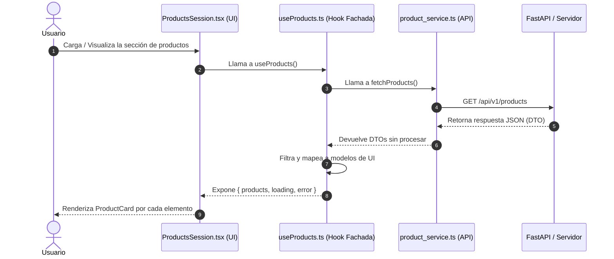
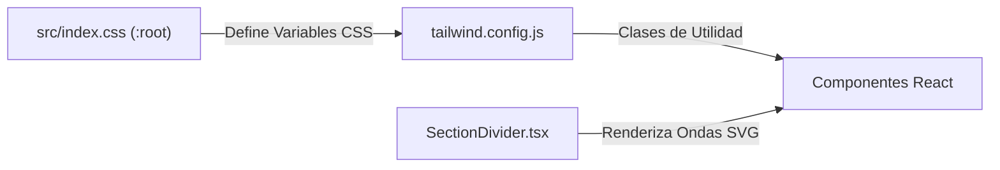

# 🐾 Web Client - Veterinaria Beltramelli (Frontend)

Plataforma de Gestión Veterinaria y E-commerce desarrollada para la **Veterinaria Beltramelli** en Salto, Uruguay. Este proyecto utiliza una arquitectura de Monorepo recomendada para escalar desde una Landing Page inicial hasta un ecosistema completo de gestión clínica, catálogo de productos y pedidos.

---

## 🚀 Stack Tecnológico (Documentación Oficial)

- **[React 19](https://react.dev/)**: Biblioteca de UI para construir la interfaz declarativa.
- **[Vite 8](https://vitejs.dev/)**: Herramienta de construcción (build tool) de alta velocidad para desarrollo local y producción.
- **[TypeScript](https://www.typescriptlang.org/)**: Tipado estático para mayor seguridad y mejor autocompletado en el editor.
- **[Tailwind CSS v3.4](https://tailwindcss.com/)**: Framework CSS de utilidades para un diseño responsivo "Pixel Perfect".
- **[React Router DOM v7](https://reactrouter.com/)**: Manejo de rutas SPA (ej. `/` para mantenimiento y `/revision` para pruebas).
- **[Lucide React](https://lucide.dev/)**: Colección de iconos vectoriales ligeros y consistentes.
- **[Lottie React](https://airbnb.io/lottie/)**: Renderizador de animaciones JSON para elementos dinámicos interactivos.

---

## 🏛️ Arquitectura del Frontend y Flujo de Datos

El frontend sigue el patrón **Fachada (Facade)** en la capa de datos/hooks y una separación limpia entre UI, estado y llamadas HTTP:

- 📄 **Diagrama de Arquitectura**: [Arquitectura del Frontend](docs/architecture/diagrama_arquitectura_fontend.md)


### 🔗 Acceso Directo a Archivos del Diagrama de Arquitectura
Para navegar directo al código desde tu editor o repositorio, haz clic en cualquiera de estos enlaces relativos:
- 📄 **Página Principal**: [LlandingPage.tsx](src/pages/landing/LlandingPage.tsx)
- 📄 **Sección de Productos**: [ProductsSession.tsx](src/pages/landing/sessions/ProductsSession.tsx)
- 📄 **Tarjeta de Producto**: [ProductCard.tsx](src/components/ProductCard.tsx)
- 📄 **Hook / Fachada de Productos**: [useProducts.ts](src/hooks/useProducts.ts)
- 📄 **Servicio API Backend**: [product_service.ts](src/services/product_service.ts)
- 📄 **Contexto de Pedidos / Carrito**: [pedido_context.tsx](src/context/pedido_context.tsx)

---

### 🔄 Diagrama de Secuencia: Obtención e Integración de Productos



### 🔗 Acceso Directo a los Métodos y Archivos del Flujo
- 🟢 **Componente Vista**: [ProductsSession.tsx](src/pages/landing/sessions/ProductsSession.tsx)
- 🟢 **Fachada / Hook**: [useProducts.ts](src/hooks/useProducts.ts)
- 🟢 **Cliente HTTP / Endpoints**: [product_service.ts](src/services/product_service.ts)

---

## 🎨 Sistema de Colores y Estilos

El sistema combina variables CSS globales centralizadas con utilidades de Tailwind CSS y divisores vectoriales SVG para intercalar fondos entre secciones:



### 🔗 Acceso Directo a Archivos de Estilos
- 🎨 **Variables CSS Globales**: [index.css](src/index.css)
- 🎨 **Configuración de Tailwind**: [tailwind.config.js](tailwind.config.js)
- 🎨 **Divisor SVG Animado**: [SectionDivider.tsx](src/components/SectionDivider.tsx)

---

## 📂 Estructura del Código en `src/`

```text
apps/web-client/src/
├── assets/          # Recursos estáticos (animaciones JSON, logos, SVGs)
│   ├── animations/  # p.ej. maintenance.json (animación de página en construcción)
│   └── branding/    # Gráficos de marcas y WhatsApp
├── components/      # UI atómica y componentes independientes de la lógica
│   ├── CategoryGroupCard.tsx   # Agrupador visual por categorías
│   ├── PlanCard.tsx            # Tarjeta de presentación de planes
│   ├── ProductCard.tsx         # Tarjeta de producto individual
│   ├── SectionDivider.tsx     # Transición ondulatoria SVG con color dinámico
│   ├── ServiceCard.tsx        # Tarjeta para mostrar servicios ofrecidos
│   ├── WhatsAppButtonProps.tsx # Tipos y props para los botones principales de contacto y llamada a la veterinaria
│   └── WhatsAppDynamicButton.tsx # Botón dinámico interactivo para comunicación directa y emergencias por WhatsApp
├── context/         # Proveedores de estado global (auth_context.tsx, pedido_context.tsx)
├── hooks/           # Custom Hooks / Fachadas de negocio (useProducts.ts)
├── mapper/          # Mapeadores de transformación de DTOs a modelos frontend
├── pages/           # Vistas / Ventanas principales conectadas al Router
│   ├── landing/     # Landing page principal y sus secciones (sessions/)
│   ├── maintenance/ # Vista de mantenimiento temporal para el root `/`
│   ├── pedido/      # [Módulo futuro] Gestión de pedidos
│   └── cliete/      # [Módulo futuro] Portal para clientes
├── services/        # Capa HTTP pura (product_service.ts, auth_service.ts, logger.ts)
├── types/           # Interfaces y tipos TypeScript
└── App.tsx          # Configuración del enrutador React Router DOM (App.tsx)
```

### 🔗 Acceso Directo a los Componentes y Vistas Principales:
- 🧩 **Sección Hero**: [HeroSession.tsx](src/pages/landing/sessions/HeroSession.tsx)
- 🧩 **Sección Cabecera / Header**: [HederSession.tsx](src/pages/landing/sessions/HederSession.tsx)
- 🧩 **Sección Pie de Página**: [FooterSession.tsx](src/pages/landing/sessions/FooterSession.tsx)
- 🧩 **Enrutador**: [App.tsx](src/App.tsx)

---

## 🛠️ Configuración de Entorno y Desarrollo Local

### 💻 Guía por Sistema Operativo y Optimización de Recursos

#### 🪟 En Windows (Recomendado usar WSL2)
Si trabajas en Windows, **se recomienda encarecidamente utilizar WSL2 (Windows Subsystem for Linux)**, especialmente en equipos con recursos limitados (ej. procesadores Dual-Core o RAM ajustada):
1. **Configuración del Entorno**: Clona e instala el proyecto dentro del sistema de archivos de Linux (ej. `~/Documentos/proyect/app/vet-core`) en lugar del sistema de archivos de Windows (`/mnt/c/`). Esto evita sobrecargar la memoria con Docker Desktop.
2. **Ejecución Directa**: Abre tu terminal WSL2 e instala Node.js (v18+).

#### 🐧 En Linux (Nativo)
Asegúrate de contar con Node.js y npm instalados:
```bash
# 1. Entrar a la carpeta del cliente web
cd apps/web-client

# 2. Instalar dependencias del proyecto
npm install

# 3. Iniciar el servidor de desarrollo en modo local (Vite)
npm run dev
```

> ⚠️ **Nota sobre el Backend**: Si el backend en FastAPI o los contenedores no están encendidos en ese momento, el cliente web cargará normalmente de todas formas utilizando los datos en caché/mock data. No se romperá la interfaz.

---

## 🌐 Pruebas en Red Local (LAN) y Compartición Temporal

### 📱 1. Pruebas en Móviles dentro de la Red Local (LAN)
Para probar la aplicación directamente desde tu celular o tablet conectado al mismo Wi-Fi:

```bash
# Ejecutar desde apps/web-client
# 1. Compilar y empaquetar la imagen Docker
sudo docker build -t vete-celu .

# 2. Detener contenedor de prueba si ya está activo
sudo docker stop vete-test

# 3. Exponer en el puerto 3000
sudo docker run -it --rm -p 3000:80 --name vete-test vete-celu
```

### ⚡ 2. Compartición en Tiempo Real mediante Túnel de Cloudflare (`exponer_entorno_tem.sh`)
Para mostrar avances a clientes o compañeros de equipo fuera de tu red local sin necesidad de publicar en producción, el proyecto cuenta con un script automatizado que genera enlaces públicos temporales en segundo plano:

```bash
# Ejecutar desde la raíz del repositorio /vet-core:
./esponer_entorno_tem.sh
```

El script ([esponer_entorno_tem.sh](../../esponer_entorno_tem.sh)) se encarga de:
- Verificar o instalar automáticamente `cloudflared`.
- Levantar un túnel HTTPS seguro para el **Frontend** (Vite) y otro para el **Backend** (FastAPI).
- Generar URLs temporales tipo `https://xxxx.trycloudflare.com` listas para compartir.

---

Desarrollado por **NorthCode**. 🚀 E-commerce & Portal Veterinaria Beltramelli. 🐄
