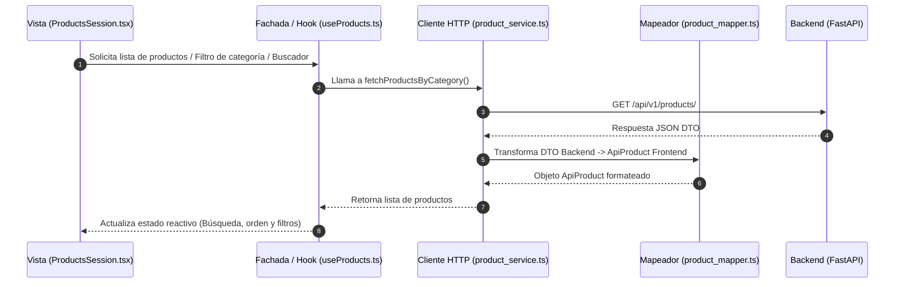

<!-- apps/web-client/README.md -->
# 🚀 Web Client - Motor E-commerce & Plataforma Web Agnóstica (White-Label / Multi-Tenant)

Plataforma Web y Motor de E-commerce **multi-tenant agnóstico** (SaaS) desarrollado con **React 19**, **Vite 8**, **TypeScript** y **Tailwind CSS**. 

Originalmente diseñado como sistema de gestión y tienda para **Veterinaria Beltramelli**, el proyecto evolucionó hacia una **arquitectura desacoplada en tiempo de ejecución (Zero-Rebuild)**. Esta arquitectura permite desplegar landing pages, catálogos interactivos, servicios y checkouts de pedidos por WhatsApp para cualquier rubro comercial (petshops, ferreterías, clínicas, farmacias, tiendas de retail) **sin necesidad de modificar ni recompilar el código fuente de la aplicación**.

---

## 📖 Sub-Documentaciones Modulares (Vistas Principales)

Para mantener una lectura ordenada y enfocada en los módulos de mayor volumen del frontend, la documentación técnica detallada de las dos interfaces principales se encuentra en sus respectivos archivos:

* 🏠 **[Módulo Landing Page (`src/pages/landing/README.md`)](src/pages/landing/README.md)**:
  Explicación paso a paso de [`LlandingPage.tsx`](src/pages/landing/LlandingPage.tsx), orquestación de sub-secciones en `sessions/` ([`HeaderSession`](src/pages/landing/sessions/HederSession.tsx), [`HeroSession`](src/pages/landing/sessions/HeroSession.tsx), [`ProductsSession`](src/pages/landing/sessions/ProductsSession.tsx), [`ServicioSession`](src/pages/landing/sessions/ServicioSession.tsx), `AboutSection`, [`MapsSession`](src/pages/landing/sessions/MapsSession.tsx) y [`FooterSession`](src/pages/landing/sessions/FooterSession.tsx)), divisores SVG animados y control de colores alternados.

* 🛒 **[Módulo de Pedidos y Carrito (`src/pages/pedido/README.md`)](src/pages/pedido/README.md)**:
  Documentación del panel lateral Off-Canvas ([`PedidoDrawer.tsx`](src/pages/pedido/PedidoDrawer.tsx)), los controles numéricos editables en [`PedidoItemRow.tsx`](src/pages/pedido/PedidoItemRow.tsx), el acordeón checkout [`PedidoFooterCollapsible.tsx`](src/pages/pedido/PedidoFooterCollapsible.tsx), gestión de pasarelas de pago/bancos y la generación de mensajes estructurados para WhatsApp.

---

## 🚀 Stack Tecnológico

- **[React 19](https://react.dev/)**: Biblioteca principal para interfaces declarativas y reactivas basadas en componentes.
- **[Vite 8](https://vitejs.dev/)**: Entorno de construcción (*build tool*) ultrarrápido para desarrollo y bundles de producción.
- **[TypeScript](https://www.typescriptlang.org/)**: Tipado estático estricto para seguridad de tipos, interfaces de configuración y mantenibilidad.
- **[Tailwind CSS v3.4](https://tailwindcss.com/)**: Framework CSS basado en utilidades con variables dinámicas inyectadas en tiempo de ejecución.
- **[React Router DOM v7](https://reactrouter.com/)**: Manejo de rutas SPA (`/` para Landing Page y `/mantenimiento` para estado de servicio).
- **[Lucide React](https://lucide.dev/)**: Librería de iconos vectoriales ligeros y configurables por clave de nombre.
- **[Lottie React](https://airbnb.io/lottie/)**: Renderizado de animaciones vectoriales JSON interactivas.
- **Node.js (Scripting CLI)**: Automatización de cambio de cliente mediante [`switch-tenant.js`](scripts/switch-tenant.js).

---

## 🏢 Arquitectura Multi-tenant SaaS (Zero-Rebuild)

La arquitectura web separa estrictamente la **identidad corporativa** del **código fuente de la aplicación**:

```text
1. [Carpeta de Cliente Host]
   clientes/valeria/config.json + assets/
           │
           ▼ (Sincronizado vía switch-tenant.js o volumen Docker)
2. [Servidor Web / Público]
   public/config/client_info.json + public/tenant/
           │
           ▼ (fetch('/config/client_info.json') al arrancar)
3. [TenantProvider (src/context/tenant_context.tsx)]
   - Descarga client_info.json y remueve comentarios en memoria (stripJsonComments)
   - Valida la estructura mediante el contrato TypeScript TenantConfig
   - Actualiza document.title y favicon
           │
           ▼
4. [Inyector de Tema (src/config/theme_config.ts)]
   - Transforma colores Hexadecimales (#275D9E) a canales RGB ("39 93 158")
   - Inyecta variables CSS en document.documentElement (:root)
           │
           ▼
5. [Tailwind CSS + UI Componentes]
   - Las clases semánticas (bg-vete-primary, text-vete-base, etc.) consumen las variables CSS
   - Los elementos multimedia consumen rutas estándar (/tenant/logo.png, /tenant/hero.png)
```

---

## 🔄 Flujo de Datos y Conexión Frontend-Backend

El frontend sigue el patrón **Fachada (Facade)** para la capa de hooks y una separación limpia entre la UI visual, el estado reactivo global del carrito y la infraestructura HTTP:



1. 🟢 **Componente Vista** ([`ProductsSession.tsx`](src/pages/landing/sessions/ProductsSession.tsx)): Renderiza la interfaz visual del catálogo, el cuadro de búsqueda y botones de filtro. Invoca al hook de fachada `useProducts`.
2. 🟢 **Fachada / Hook** ([`useProducts.ts`](src/hooks/useProducts.ts)): Encapsula la búsqueda en tiempo real, filtrado por categorías, ordenamiento y manejo de estados de carga y error.
3. 🟢 **Cliente HTTP** ([`product_service.ts`](src/services/product_service.ts)): Capa de infraestructura de red hacia la API REST en FastAPI.
4. 🟢 **Mapeador de Modelos** ([`product_mapper.ts`](src/mapper/product_mapper.ts)): Transforma los DTO del backend a los tipos del frontend ([`product_types.ts`](src/types/product_types.ts)).
5. 🟢 **Contexto de Pedidos** ([`pedido_context.tsx`](src/context/pedido_context.tsx)): Gestor de estado global del carrito. Sincroniza productos seleccionados con el panel lateral ([`PedidoDrawer.tsx`](src/pages/pedido/PedidoDrawer.tsx)).

---

## 🎨 Paleta de Tokens Semánticos (`vete-*`)

Para garantizar que el diseño responda dinámicamente al cliente activo, los componentes utilitarios leen variables CSS semánticas inyectadas por [`theme_config.ts`](src/config/theme_config.ts):

| Clase Tailwind | Propósito y Definición |
| :--- | :--- |
| `bg-vete-primary` / `text-vete-primary` | Color principal de marca (Botones CTA, enlaces activos, acentos). |
| `hover:bg-vete-primary-hover` | Estado hover para elementos interactivos principales. |
| `bg-vete-secondary` / `text-vete-secondary` | Color secundario (Badges, chips y acentos complementarios). |
| `bg-vete-tertiary` / `text-vete-tertiary` | Canales de contacto directo (WhatsApp, teléfonos). |
| `bg-vete-dark` | Fondos oscuros estructurales (Header, Footers, Modales). |
| `bg-vete-surface` | Fondo para tarjetas de productos y áreas de contenido claro. |
| `bg-vete-soft` / `text-vete-soft` | Tinte suave de marca para fondos de chips y pasivos. |
| `bg-vete-overlay` | Fondos con oscurecimiento para backdrops de modales y drawers. |
| `text-vete-base` | Color tipográfico principal para textos de lectura continua. |
| `text-vete-muted` | Color tipográfico secundario para subtítulos y placeholders. |
| `border-vete-subtle` | Bordes suaves y líneas divisorias de contenedores. |
| `text-vete-error` / `bg-vete-error` | Acciones destructivas (vaciar carrito, eliminar ítems, alertas). |

---

## 📂 Estructura Completa del Proyecto

A continuación se detalla la estructura del cliente web y su integración con el directorio de clientes multi-tenant:

```text
vet-core/
├── 📁 clientes/                           # 🏢 Directorio de clientes multi-tenant
│   ├── 📁 _template/                     # ✅ Plantilla base con config.json documentado y assets de ejemplo
│   │   ├── 📄 config.json
│   │   └── 📁 assets/                    # (logo.png, hero.png, mision.png, etc.)
│   ├── 📁 valeria/                        # Datos e imágenes de cliente real
│   └── 📁 flavia_esponda/                 # Datos e imágenes de otro cliente real
│
└── 📁 apps/web-client/
    ├── 📄 package.json                    # Dependencias y scripts CLI de tenant
    ├── 📄 vite.config.ts                  # Configuración de Vite 8 y servidor de desarrollo
    ├── 📄 tailwind.config.js              # Configuración de Tailwind CSS con colores dinámicos
    ├── 📄 dockerfile                      # Dockerfile para compilación NGINX SPA
    ├── 📄 docker-compose.yml              # Despliegue con montaje de volúmenes por cliente
    │
    ├── 📁 public/                         # Archivos estáticos servidos dinámicamente
    │   ├── 📁 config/
    │   │   └── 📄 client_info.json        # 🔄 Configuración activa del cliente en runtime
    │   └── 📁 tenant/                     # 🔄 Recursos gráficos activos del cliente (/tenant/logo.png)
    │
    ├── 📁 scripts/
    │   └── 📄 switch-tenant.js            # Script CLI Node.js para alternar cliente activo
    │
    └── 📁 src/
        ├── 📄 App.tsx                     # Enrutador principal (React Router DOM v7)
        ├── 📄 main.tsx                    # Punto de entrada React 19 / Vite
        ├── 📄 index.css                   # Directivas Tailwind y variables CSS (:root)
        │
        ├── 📁 config/                     # Configuraciones del cliente
        │   ├── 📄 theme_config.ts         # Inyector dinámico de variables CSS Hex -> RGB
        │   └── 📄 ui-config.ts            # Constantes y parámetros de UI
        │
        ├── 📁 context/                    # Estado Global de React
        │   ├── 📄 tenant_context.tsx      # Proveedor de configuración del tenant (TenantProvider / useConfig)
        │   ├── 📄 pedido_context.tsx      # Estado global del carrito de compras
        │   └── 📄 auth_context.tsx        # Contexto de autenticación
        │
        ├── 📁 types/                      # Tipos estricto TypeScript
        │   ├── 📄 tenant_types.ts         # Contrato e interfaces del archivo config.json (TenantConfig)
        │   ├── 📄 product_types.ts        # Interfaces de productos y categorías
        │   ├── 📄 pedido_types.ts         # Estructuras de pedido y carrito
        │   └── 📄 auth.ts                 # Tipos de sesión de usuario
        │
        ├── 📁 pages/                      # Páginas y Vistas Principales
        │   ├── 📁 landing/                # 🏠 Módulo Landing Page
        │   │   ├── 📄 LlandingPage.tsx    # Orquestador visual principal
        │   │   ├── 📄 README.md           # 📖 Documentación detallada del Módulo Landing
        │   │   └── 📁 sessions/           # Sub-secciones (Header, Hero, Products, Services, Maps, Footer)
        │   ├── 📁 pedido/                 # 🛒 Módulo Pedidos y Carrito
        │   │   ├── 📄 PedidoDrawer.tsx    # Drawer lateral de checkout
        │   │   └── 📄 README.md           # 📖 Documentación detallada del Módulo Pedidos
        │   └── 📁 maintenance/            # Vista de mantenimiento temporal
        │
        ├── 📁 components/                 # Componentes UI reutilizables
        │   ├── 📁 ProductCard/            # Tarjetas de productos (Variantes V1 y V2)
        │   ├── 📄 SectionDivider.tsx      # Divisor SVG animado con colores dinámicos
        │   ├── 📄 ServiceCard.tsx         # Tarjeta genérica de servicios con icono
        │   ├── 📄 PlanCard.tsx            # Tarjeta de paquetes y promociones
        │   └── 📄 WhatsAppDynamicButton.tsx # Botón interactivo directo a WhatsApp
        │
        ├── 📁 hooks/                      # Custom Hooks / Fachadas de Negocio
        │   ├── 📄 useProducts.ts          # Búsqueda, filtrado y ordenamiento de catálogo
        │   └── 📄 useAddressManagement.ts # Gestión de direcciones de entrega
        │
        ├── 📁 services/                   # Cliente HTTP e Infraestructura
        │   ├── 📄 product_service.ts      # Consumo de API REST (FastAPI)
        │   └── 📄 logger.ts               # Registrador de eventos de sistema
        │
        └── 📁 mapper/                     # Mapeador de datos DTO -> Modelos Frontend
            └── 📄 product_mapper.ts       # Transformación de respuesta API Backend
```

---

## 🛠️ Guía de Operación Diaria y Comandos CLI

### 1. Ejecución en Desarrollo Local (Vite)

```bash
# Entrar a la carpeta del cliente web
cd apps/web-client

# Instalar dependencias
npm install

# Iniciar servidor local (puerto predeterminado Vite)
npm run dev
```

### 2. Cambiar de Cliente en Tiempo de Desarrollo

Puedes alternar el cliente activo en tu entorno local usando los comandos preconfigurados o pasando el nombre de la carpeta dentro de `clientes/`:

```bash
# Cambiar al cliente "valeria" y levantar el servidor:
npm run dev:valeria

# Cambiar al cliente "flavia_esponda" y levantar el servidor:
npm run dev:flavia

# Cambiar a la plantilla base de pruebas:
npm run dev:template

# Cambiar a cualquier cliente arbitrario existente en /clientes:
npm run tenant <nombre_carpeta_cliente>
```

### 3. Crear un Cliente Nuevo en 3 Pasos

1. Duplica la carpeta `clientes/_template/` y asígnale el nombre del cliente (ej: `clientes/ferreteria_central/`).
2. Agrega las imágenes del cliente en `clientes/ferreteria_central/assets/` (`logo.png`, `hero.png`, `mision.png`, etc.).
3. Edita la paleta de colores, textos institucionales y números de teléfono en `clientes/ferreteria_central/config.json`.
4. Ejecuta la sincronización:
   ```bash
   npm run tenant ferreteria_central
   ```

---

## 🐳 Despliegue en Producción (Docker Multi-Tenant)

En entornos de producción, se compila **una única imagen Docker** de la aplicación React. Cada cliente se despliega como un contenedor independiente montando su configuración y activos como volúmenes de solo lectura (`ro`):

```yaml
version: '3.8'

services:
  web_valeria:
    image: vetcore-frontend:latest
    container_name: web_valeria
    restart: always
    volumes:
      - ./clientes/valeria/config.json:/usr/share/nginx/html/config/client_info.json:ro
      - ./clientes/valeria/assets:/usr/share/nginx/html/tenant:ro
    ports:
      - "3001:80"

  web_flavia:
    image: vetcore-frontend:latest
    container_name: web_flavia
    restart: always
    volumes:
      - ./clientes/flavia_esponda/config.json:/usr/share/nginx/html/config/client_info.json:ro
      - ./clientes/flavia_esponda/assets:/usr/share/nginx/html/tenant:ro
    ports:
      - "3002:80"
```

---

## 🌐 Pruebas en Red Local (LAN) y Túneles Temporales

### 📱 1. Pruebas en Móviles dentro de la Red Local (LAN)

```bash
# 1. Compilar imagen Docker local
sudo docker build -t web-client-test .

# 2. Correr el contenedor en el puerto 3000
sudo docker run -it --rm -p 3000:80 --name web-test web-client-test
```

### ⚡ 2. Compartición mediante Túnel de Cloudflare

Para exponer el entorno de pruebas de forma segura hacia clientes externos:

```bash
# Ejecutar desde la raíz del repositorio /vet-core:
./esponer_entorno_tem.sh
```

El script [`esponer_entorno_tem.sh`](../../esponer_entorno_tem.sh) levantará un túnel HTTPS temporal vía Cloudflare para el frontend y backend.

---

## 💡 Recomendaciones para Completar el Agnosticado del Código (Próximos Pasos)

Para finalizar la conversión de la plataforma en un motor 100% agnóstico y multi-rubro, se recomiendan las siguientes mejoras arquitectónicas:

1. **Resolución Dinámica de Iconos en Servicios y Categorías**:
   - *Estado actual*: `ServiceCard.tsx` y `categoryHelpers.tsx` poseen un mapa estático (`ICON_MAP`).
   - *Mejora recomendada*: Implementar un componente `DynamicLucideIcon` que reciba `name: string` (ej. `"ShoppingBag"`, `"Wrench"`, `"Stethoscope"`) y resuelva dinámicamente la propiedad `icon_name` del `config.json`.

2. **Parametrización del Botón y Sección de Contacto Rápido / Urgencias**:
   - *Estado actual*: El interruptor `has_emergency_button` asume el texto de "Urgencias 24h".
   - *Mejora recomendada*: Extender `contact` en `config.json` con `emergency_label` (ej: `"Urgencias 24h"`, `"Atención Directa"`, `"Consulta Flash"`), permitiendo que rubros no médicos adapten la llamada a la acción.

3. **Internacionalización de Monedas y Formato de Precios**:
   - *Estado actual*: El formateador asigna por defecto el signo pesos uruguayos (`$`).
   - *Mejora recomendada*: Agregar la propiedad `currency_symbol` (`"$"`, `"USD"`, `"ARS"`, `"MXN"`) en la sección de temas/configuración para soporte multi-moneda automático en el carrito y tarjetas.

4. **Abstracción de Datos Fallback**:
   - *Estado actual*: Los archivos de fallback `productos.json`, `servicios.json` y `companyInfo.json` en `src/data/` contienen información con datos de prueba veterinarios.
   - *Mejora recomendada*: Mover los datos de prueba predeterminados a `clientes/_template/` para que la carpeta base `src/data/` contenga únicamente plantillas sin sesgo de dominio.

5. **Renombrado Progresivo del Prefijo de Tokens CSS (`vete-*`)**:
   - *Estado actual*: Los tokens semánticos utilizan el prefijo `vete-primary`, `vete-dark`, etc.
   - *Mejora recomendada*: Reemplazar progresivamente en la configuración de Tailwind el prefijo `vete-` por `tenant-` (ej. `bg-tenant-primary`, `text-tenant-base`) para desvincular por completo la sintaxis de clases del término veterinario.

---

Desarrollado por **[NorthCode](https://github.com/NorthCodeUY)** 🚀 - Motor Web Agnóstico & Plataforma E-commerce White-Label.
