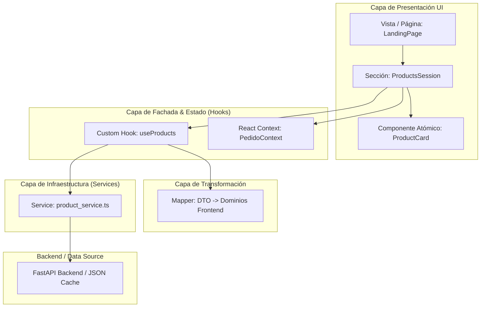

# 🏛️ Arquitectura del Frontend

```mermaid
graph TD
    subgraph "Capa de Presentación UI"
        Page["Vista / Página: LandingPage"]
        Section["Sección: ProductsSession"]
        Component["Componente Atómico: ProductCard"]
    end

    subgraph "Capa de Fachada & Estado (Hooks)"
        Hook["Custom Hook: useProducts"]
        Context["React Context: PedidoContext"]
    end

    subgraph "Capa de Transformación"
        Mapper["Mapper: DTO -> Dominios Frontend"]
    end

    subgraph "Capa de Infraestructura (Services)"
        Service["Service: product_service.ts"]
    end

    subgraph "Backend / Data Source"
        API["FastAPI Backend / JSON Cache"]
    end

    Page --> Section
    Section --> Component
    Section --> Hook
    Section --> Context
    Hook --> Service
    Hook --> Mapper
    Service --> API

    %% LINKS CORREGIDOS (Rutas relativas desde apps/web-client/docs/architecture/)
    click Page "../../src/pages/landing/LlandingPage.tsx" "Ir a la Página"
    click Section "../../src/pages/landing/sessions/ProductsSession.tsx" "Ir a la Sección"
    click Component "../../src/components/ProductCard.tsx" "Ir al Componente"
    click Hook "../../src/hooks/useProducts.ts" "Ir al Hook"
    click Service "../../src/services/product_service.ts" "Ir al Servicio"
    click API "../../../../api-backend/main.py" "Ir al Backend"
```