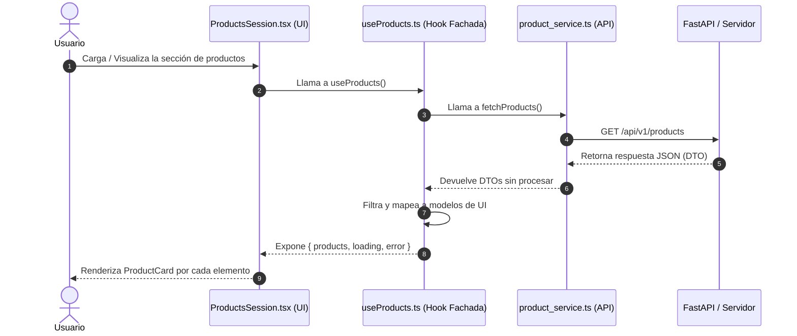

### 🔄 Diagrama de Secuencia: Obtención e Integración de Productos

```mermaid
sequenceDiagram
    autonumber
    actor Usuario
    participant UI as ProductsSession.tsx (UI)
    participant Hook as useProducts.ts (Hook Fachada)
    participant Service as product_service.ts (API)
    participant Backend as FastAPI / Servidor

    Usuario->>UI: Carga / Visualiza la sección de productos
    UI->>Hook: Llama a useProducts()
    Hook->>Service: Llama a fetchProducts()
    Service->>Backend: GET /api/v1/products
    Backend-->>Service: Retorna respuesta JSON (DTO)
    Service-->>Hook: Devuelve DTOs sin procesar
    Hook->>Hook: Filtra y mapea a modelos de UI
    Hook-->>UI: Expone { products, loading, error }
    UI-->>Usuario: Renderiza ProductCard por cada elemento
```