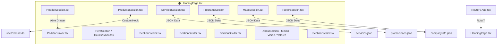

<!-- apps/web-client/src/pages/landing/README.md -->
# 🏠 Módulo Landing Page (`pages/landing`)

Documentación técnica y funcional del módulo de **Landing Page** (Página Principal de Inicio) de **Veterinaria Beltramelli**.

---

## 📌 Visión General

La **Landing Page** es el punto de entrada principal y orquestador de la experiencia del usuario en la web client de Veterinaria Beltramelli. Presenta la propuesta de valor de la empresa, muestra la clínica y sus servicios, ofrece un catálogo de productos interactivo integrado con el carrito de compras, detalla los planes sanitarios, presenta la misión/visión corporativa y proporciona la ubicación con mapa interactivo y canales directos de comunicación por WhatsApp.

La interfaz está construida mediante una arquitectura modular en la carpeta `sessions/`, intercalando divisores con ondas vectoriales dinámicas (`SectionDivider.tsx`) que garantizan transiciones visuales suaves ("Pixel Perfect") entre esquemas de color claros y oscuros.

---

## 📁 Estructura del Directorio

```text
apps/web-client/src/pages/landing/
├── LlandingPage.tsx             # Orquestador principal de la vista de Landing Page
├── descarteLandigPage.tsx       # [Borrador/Auxiliar] Versión alternativa de pruebas
├── README.md                    # Documentación del módulo (Este archivo)
└── sessions/                    # Sub-componentes modulares por sección de la Landing
    ├── HederSession.tsx         # Cabecera de navegación superior (Sticky Header)
    ├── HeroSession.tsx          # Banner principal de impacto visual (Hero)
    ├── ProductsSession.tsx      # Catálogo de productos interactivo y buscador
    ├── ServicioSession.tsx      # Grilla de servicios veterinarios (Ganadería, Mascotas, Equinos)
    ├── MapsSession.tsx          # Sección de ubicación con mapa interactivo de Google Maps
    ├── FooterSession.tsx        # Pie de página corporativo con contacto y barra de emergencia
    └── descarteSession.tsx      # [Borrador/Auxiliar] Sección de pruebas temporales
```

---

## 📐 Arquitectura de Componentes y Flujo de Secciones

El componente maestro [`LlandingPage.tsx`](LlandingPage.tsx) ensambla verticalmente cada sección dentro de un contenedor principal, inyectando propiedades de color (`bgColor`) y divisores estilizados:



---

## 🧩 Descripción Detallada de Secciones y Componentes

### 1. [`HederSession.tsx`](sessions/HederSession.tsx) (Cabecera y Navegación)
Barra de navegación fija en la parte superior (`sticky top-0 z-50`).

* **Características**:
  * **Logo Corporativo**: Muestra el isotipo y marca de la veterinaria.
  * **Navegación Fluida (`NAV_LINKS`)**: Enlaces internos con desplazamiento suave hacia `#ServicioSeccion`, `#ProgramsSection`, `#ProductsSession`, `#AboutSection` y `#MapsSection`.
  * **Acceso al Carrito**: Botón destacado con icono de carrito de compras que muestra un badge dinámico en tiempo real con la cantidad de ítems agregados (`itemCount` desde `usePedidoStore`). Al hacer clic, despliega el [`PedidoDrawer`](../pedido/PedidoDrawer.tsx).
  * **Menú Móvil Responsive**: Botón *hamburger* que conmuta la visibilidad del menú desplegable en dispositivos móviles.

---

### 2. `HeroSection` / [`HeroSession.tsx`](sessions/HeroSession.tsx) (Banner Principal)
Primera sección de impacto visual que recibe al visitante.

* **Props**: `bgColor: string` (Control de color de fondo).
* **Contenido**:
  * Titular principal: *"Cuidamos a quienes amás"*.
  * Párrafo descriptivo del compromiso médico y profesional de la clínica.
  * Fotografía destacada estilizada con bordes redondeados (`rounded-[3rem]`).
  * Enlace o botón directo de contacto de urgencias.

---

### 3. [`ProductsSession.tsx`](sessions/ProductsSession.tsx) (Catálogo de Productos)
Módulo central para la navegación comercial de productos disponibles en la veterinaria.

* **Props**: `bgColor: string`.
* **Integración de Datos**:
  * Utiliza la fachada de datos [`useProducts.ts`](../../hooks/useProducts.ts).
  * Maneja filtrado por categorías (Alimentos, Medicamentos, Accesorios, etc.) e insumos ganaderos.
  * Integra campo de búsqueda textual interactiva.
* **Componentes Hijos**:
  * Renderiza una grilla responsiva de tarjetas [`ProductCard.tsx`](../../components/ProductCard.tsx), permitiendo agregar unidades directamente al estado global del pedido.

---

### 4. [`ServicioSession.tsx`](sessions/ServicioSession.tsx) (Catálogo de Servicios)
Despliega las áreas de especialización veterinaria de la clínica.

* **Props**: `bgColor: string`.
* **Fuentes de Datos**: Carga información estructurada desde [`servicios.json`](../../data/servicios.json).
* **Especialidades**:
  1. **Animales de Producción / Campo**: Asesoramiento zootécnico, planes sanitarios ganaderos y trazabilidad DICOSE.
  2. **Pequeños Animales / Mascotas**: Consulta clínica, vacunación, desparasitación y cirugías.
  3. **Equinos**: Atención especializada para caballos de deporte y trabajo.
* **Componentes Hijos**: Renderiza tarjetas de servicios [`ServiceCard.tsx`](../../components/ServiceCard.tsx).

---

### 5. `ProgramsSection` (Programas de Bienestar Animal)
Sección dedicada a planes de salud preventiva y ofertas especiales.

* **Fuentes de Datos**: Carga datos desde [`promociones.json`](../../data/promociones.json) e inyecta el teléfono corporativo desde [`companyInfo.json`](../../data/companyInfo.json).
* **Componentes Hijos**: Renderiza la grilla de tarjetas [`PlanCard.tsx`](../../components/PlanCard.tsx) con llamada a acción directa a WhatsApp.

---

### 6. `AboutSection` (Misión, Visión y Valores)
Sección institucional que transmite la historia, filosofía y principios rectores de Veterinaria Beltramelli.

* **Estructura Interna**:
  * Utiliza el sub-componente helper `InfoSection` para alternar la disposición de imagen y texto de manera invirtible (`reversed={true}`).
  * **Misión**: Enfoque integral entre la salud de pequeñas mascotas y la producción ganadera responsable en Salto.
  * **Visión**: Aspiración a ser referente regional en medicina veterinaria basada en la confianza y el rigor técnico.
  * **Valores**: Compromiso con la vida, profesionalismo, empatía y responsabilidad ética.

---

### 7. [`MapsSession.tsx`](sessions/MapsSession.tsx) (Ubicación y Horarios)
Mapeo geográfico interactivo de la sucursal de la veterinaria.

* **Props**: `bgColor: string`.
* **Fuentes de Datos**: Carga dirección física, mapa embebido de Google Maps y horarios de atención desde [`companyInfo.json`](../../data/companyInfo.json).
* **Elementos Visuales**:
  * Mapa interactivo iframe responsivo.
  * Tarjetas de información destacadas con horarios habituales y atención de emergencias.

---

### 8. [`FooterSession.tsx`](sessions/FooterSession.tsx) (Pie de Página)
Sección final de la página web con accesos directos y enlaces corporativos.

* **Props**: `bgColor: string`.
* **Barra Flotante de Emergencias**: Acceso directo con un toque para llamadas de urgencia 24/7 o consultas por WhatsApp.
* **Información Corporativa**: Redes sociales (Instagram, Facebook), correo electrónico, teléfono administrativo y dirección.
* **Derechos de Autor**: Mención y créditos de desarrollo por **NorthCode**.

---

## 🎨 Transiciones de Color con `SectionDivider.tsx`

Para intercalar fondos entre secciones de colores alternados (ej. `bg-vete-dark` y `bg-vete-secondary`), la Landing Page utiliza [`SectionDivider.tsx`](../../components/SectionDivider.tsx):

```tsx
<SectionDivider
  topColor="bg-vete-dark"
  bottomColor="text-vete-secondary"
/>
```

Este componente renderiza un vector SVG ondulatorio cuya clase fill/text adopta dinámicamente los colores del tema de Tailwind CSS, creando un efecto de empalme fluido y elegante.

---

## 🗂️ Archivos Auxiliares / Descarte

* [`descarteLandigPage.tsx`](descarteLandigPage.tsx): Archivo borrador de versiones anteriores de la Landing Page preservedo para referencia de maquetación.
* [`sessions/descarteSession.tsx`](sessions/descarteSession.tsx): Componente auxiliar reservado para maquetación de prueba de nuevas secciones.
