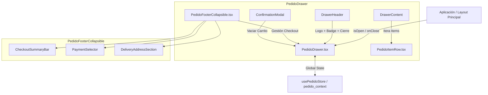

# 🛒 Módulo de Pedidos y Carrito de Compras (`pages/pedido`)

Documentación detallada del módulo de checkout y carrito de compras lateral (Drawer) de **Veterinaria Beltramelli**.

---

## 📌 Visión General

El módulo `pedido` gestiona la experiencia de compra del cliente en la aplicación web. Permite seleccionar productos, modificar cantidades, elegir el método de pago y especificar la modalidad de entrega (retiro en sucursal o envío a domicilio en Salto, Uruguay). 

Dado que el sistema no requiere un backend de pagos tradicional en su primera etapa, el cierre del pedido se realiza construyendo y enviando un mensaje estructurado y enriquecido directamente a la cuenta de **WhatsApp empresarial**.

---

## 📁 Estructura del Directorio

```text
apps/web-client/src/pages/pedido/
├── PedidoDrawer.tsx            # Componente contenedor principal (Off-canvas Drawer)
├── PedidoFooterCollapsible.tsx # Footer colapsable con opciones de pago y entrega
├── PedidoItemRow.tsx           # Fila de item del carrito con controles de cantidad
├── actualizacionPedido.tsx     # [Borrador/Futuro] Gestión de direcciones guardadas y perfil
├── descarte_pedido.tsx        # Archivo auxiliar / descarte
└── README.md                   # Documentación del módulo (Este archivo)
```

---

## 📐 Arquitectura de Componentes



### 🔄 Diagrama de Estado del Footer Colapsable (`isExpanded`)

```text
┌─────────────────────────────────────────────────────────┐
│                 isExpanded = false / true               │ (Interruptor Acordeón)
└────────────────────────────┬────────────────────────────┘
             ┌───────────────┴───────────────┐
             ▼                               ▼
   ESTADO CERRADO (false)          ESTADO ABIERTO (true)
   ───────────────────────         ───────────────────────
   1. Muestra CheckoutSummaryBar   1. Muestra botón de plegado
      (💵 Método | 📍 Dirección)   2. Despliega sub-componentes:
   2. Mantiene footer compacto        • PaymentSelector (desplegable + datos bancarios)
   3. Muestra Total y Botón WPP       • DeliveryAddressSection (Retiro vs Domicilio)
```

---

## 🧩 Descripción Detallada de Componentes

### 1. `PedidoDrawer.tsx`
Contenedor maestro lateral (Off-canvas slide-over). 

* **Props**:
  * `isOpen: boolean`: Controla la visibilidad y animación de deslizamiento.
  * `onClose: () => void`: Callback para cerrar el panel.
* **Sub-componentes Internos**:
  * `DrawerHeader`: Renderiza el isotipo y marca corporativa, textura de pasto invertido (`NavPasto.png`), el badge dinámico con el total de ítems (`ShoppingCart`) y el botón circular de cierre (`X`).
  * `DrawerContent`: Área scrollable que muestra la lista de `PedidoItemRow` o una pantalla vacía estilizada con el icono `Package` si no hay elementos.
* **Modales**:
  * Integra `ConfirmationModal` para confirmar la acción de vaciar el carrito por completo.

---

### 2. `PedidoFooterCollapsible.tsx`
Pie de página interactivo estilo acordeón anclado a la base del drawer (`sticky bottom-0`).

* **Props**:
  * `onClearCart: () => void`: Dispara el modal de confirmación en el padre.
* **Estados Locales**:
  * `isExpanded: boolean`: Controla el colapso/expansión del acordeón.
  * `selectedMethod: string`: Método de pago seleccionado (`'efectivo'`, `'transferencia'`, `'tarjeta'`, `'mercadopago'`).
  * `address: string`: Dirección de entrega o `"Retiro en Local"`.
* **Sub-componentes Internos**:
  * `PAYMENT_METHODS`: Constante con la definición de íconos, descripciones y generador de mensaje para WhatsApp de cada pasarela.
  * `PaymentSelector`: Selector `<select>` estilizado. Si se elige `'transferencia'`, muestra una tarjeta interactiva con los datos de cuenta bancaria (`companyInfo.json`).
  * `CheckoutSummaryBar`: Fila resumen interactiva visible cuando el panel está replegado.
  * `DeliveryAddressSection`: Selector binario ("Retiro en Local" vs "Envío a Domicilio") con campo de entrada asistido y enlace a Google Maps.
* **Generación de Pedido por WhatsApp (`handleConfirmOrder`)**:
  * Valida dirección y carrito no vacío.
  * Formatea la fecha, hora y teléfono en formato uruguayo (`598...`).
  * Construye un mensaje estructurado en Markdown de WhatsApp con el detalle de items, subtotales, total general y enlace para re-hidratar o compartir el pedido.

---

### 3. `PedidoItemRow.tsx`
Representa cada línea de producto dentro del carrito (`PedidoItem`).

* **Props**:
  * `item: PedidoItem`: Objeto con la información del producto (`ApiProduct`), la cantidad y el precio unitario capturado.
* **Funcionalidad de Cantidad Editable**:
  * Control manual vía `<input inputMode="numeric">` sincronizado mediante `useEffect`.
  * Saneamiento de texto en `onChange` para aceptar solo valores numéricos.
  * Validación estricta en `onBlur` (`handleQuantityInputBlur`) que asegura valores $\ge 1$ y revierte entradas inválidas.
  * Botones rápidos `+` (incrementar) y `-` (decrementar o eliminar si la cantidad es 1).

---

### 4. `actualizacionPedido.tsx` *(Borrador para Versiones Futuras)*
Archivo de preservación de código para cuando el proyecto incorpore autenticación y backend persistente:
* Incluye la entidad `UserProfile`.
* Hook `useUserInitialAddress` para simular la carga de direcciones guardadas.
* Componente `AddressManager` para crear, editar, eliminar y seleccionar direcciones del perfil del cliente.

---

### 5. `descarte_pedido.tsx`
Archivo de descarte/auxiliar reservado para pruebas temporales.

---

## 🔑 Integración con el Estado Global (`usePedidoStore`)

Ubicado en `src/context/pedido_context.tsx`, proporciona la fachada de estado reactivo:

| Propiedad / Método | Tipo | Descripción |
| :--- | :--- | :--- |
| `pedido` | `PedidoItem[]` | Array con los productos en el carrito. |
| `total` | `number` | Sumatoria total calculada reactivamente (`useMemo`). |
| `itemCount` | `number` | Cantidad total acumulada de unidades (`useMemo`). |
| `addToPedido(product)` | `(product: ApiProduct) => void` | Agrega un producto o incrementa su cantidad. |
| `updateItemQuantity(id, qty)` | `(id: number, qty: number) => void` | Modifica la cantidad directamente (elimina si `qty === 0`). |
| `removeFromPedido(id)` | `(id: number) => void` | Decrementa 1 unidad o elimina la línea. |
| `removAllPedido(id)` | `(id: number) => void` | Elimina la línea completa independientemente de la cantidad. |
| `clearPedido()` | `() => void` | Vacía por completo el carrito. |

---

## 💳 Métodos de Pago Soportados

| Método | ID | Descripción | Mensaje de WhatsApp Generado |
| :--- | :--- | :--- | :--- |
| 💵 **Efectivo** | `efectivo` | Pago en mano al recibir | Coordinar cambio con vendedor |
| 🏦 **Transferencia** | `transferencia` | BROU / PREX / Santander | Adjunta datos de cuenta (Banco, N° Cuenta, Titular) |
| 💳 **Tarjeta** | `tarjeta` | Débito o Crédito al entregar | Solicita llevar terminal POS |
| 📱 **Mercado Pago** | `mercadopago` | Link de pago / Código QR | Solicita envío de link o código QR |

---

## 🎨 Estilos y UI/UX

* **Tema de colores Tailwind**: Utiliza las variables corporativas del proyecto:
  * `bg-vete-secondary` / `bg-vete-dark` / `bg-vete-card-white`
  * `text-vete-primary` / `text-vete-dark-green` / `text-vete-text-muted`
* **Transiciones**: Animaciones fluidas de deslizamiento para el Drawer (`translate-x-0` / `translate-x-full`) y de altura para el acordeón (`max-h-[500px] opacity-100`).
